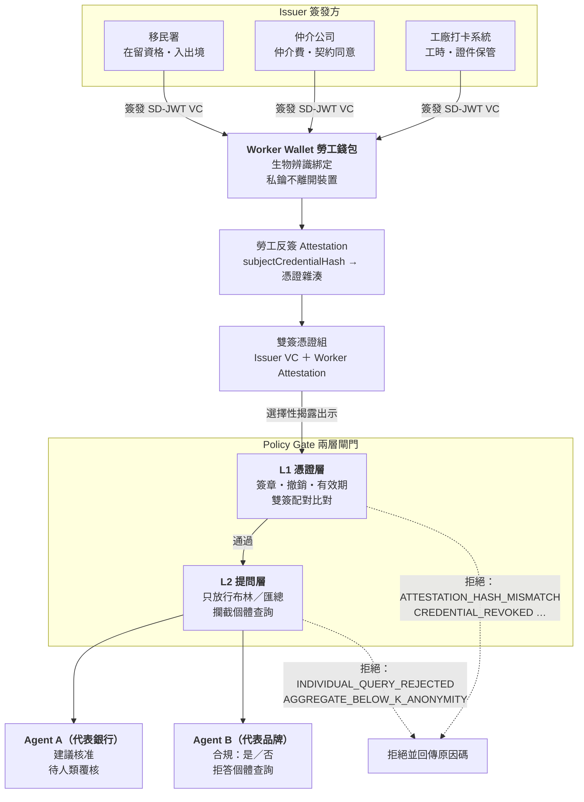

# Evidence at Source — Repo 骨架與 PoC 實作計畫

> **For agentic workers:** REQUIRED SUB-SKILL: Use superpowers:subagent-driven-development (recommended) or superpowers:executing-plans to implement this plan task-by-task. Steps use checkbox (`- [ ]`) syntax for tracking.

**Goal:** 建立 `zuemen/evidence-at-source` 的初始骨架（README、CLAUDE.md、憑證規格、兩支已驗證的 PoC 腳本、授權與 gitignore），跑通 PoC 後推送到 GitHub，作為 2026 可信 AI 黑客松報名表加分欄位的連結。

**Architecture:** 本階段**不寫任何 M1–M6 應用程式碼**。交付物是「文件 + 兩支獨立可執行的 Node ESM 腳本」。兩支腳本各自證明一個核心機制：`selective-disclosure.mjs` 證明驗證方拿不到原始欄位；`dual-signature.mjs` 證明雇主事後改資料會使勞工反簽的配對雜湊失效。腳本刻意零框架、零建置步驟——評審 `npm install && npm run demo:*` 就能看到輸出。

**Tech Stack:** TypeScript / Node 22 / React 18 + Vite / SD-JWT VC（`@sd-jwt/sd-jwt-vc` ^0.20.0、`@sd-jwt/crypto-nodejs` ^0.20.0、`jose` ^6.2.3）。本階段只實際用到 Node + 上述三個套件。

---

## 前置條件（開工前必讀）

**P1. 專案目錄。** 本機路徑固定為 `C:\Users\sanketsu\Desktop\evidence-at-source`。此路徑位於家目錄的外層 git repo 之內，因此**必須**在專案目錄自行 `git init`，形成獨立 repo；不要把檔案 commit 進外層那個 repo。

**P2. 四份規格文件。** 撰寫本計畫時，`docs/` 下的四份文件（`痛點證據與可解決性評估.md`、`技術設計與論點防禦手冊.md`、`ADR-001-系統架構與技術選型.md`、`BUILD-SPEC-開發規格書.md`）**尚未放入專案**。因此：

- **若執行時這四份文件已存在**：先讀 `BUILD-SPEC-開發規格書.md` 的 §2 §3 與 `ADR-001`，**以文件內容為準**覆寫本計畫 Task 5 給出的憑證欄位表與失敗原因碼；差異之處以規格文件為權威。
- **若仍不存在**：直接採用本計畫 Task 5 的欄位表作為權威定義（該表由題目敘述的四項事實與 PoC 腳本的實際 claim 推導而來，`WorkingHoursCredential` 的欄位與 PoC 完全一致），並在 `docs/credentials.md` 標註「本表為骨架階段定義，BUILD-SPEC §2 入庫後以其為準」。

**P3. Node 版本。** 本機全域為 Node v25.8.0，規格目標為 Node 22。PoC 腳本只用到標準 ESM + `node:crypto`，v25 預期可跑。**若 Task 2 的 `npm install` 或腳本執行出錯，先 `node -v`，切換到 Node 22 LTS 重試**，不要修改腳本邏輯。

**P4. GitHub repo。** `https://github.com/zuemen/evidence-at-source` 可能尚未建立。Task 7 含建立步驟。repo 必須是 **public**（評審要點進去看）。

---

## Global Constraints

以下規則適用於**每一個 Task**，不再逐項重述：

- **語言**：所有文件、README、Markdown 內文一律**繁體中文**；**程式碼註解、變數名、commit message 一律英文**。
- **本階段範圍**：只做骨架與文件。**不得**開始寫 M1–M6 的實作（shared / issuer / agents / wallet / console 等模組一律不建立）。實作自 2026/08/10 起依 BUILD-SPEC 排程進行。
- **PoC 程式碼照抄**：`poc/selective-disclosure.mjs`、`poc/dual-signature.mjs`、`poc/package.json` 的內容**逐字照抄本計畫**，不得改動邏輯、不得「順手優化」、不得加 try/catch、不得改變 console.log 文字。
- **禁止實作的函式**（全 repo，任何語言，任何階段）：`approveAccount`、`rejectAccount`、`freezeAccount`、`transferFunds`、`readTransactionHistory`，以及任何回傳個別勞工清單或明細的查詢函式。**不是寫出來再用 if 擋掉——根本不要寫。**
- **命名慣例**：憑證型別 PascalCase 且以 `Credential` 結尾（例：`WorkingHoursCredential`）；失敗原因碼 SCREAMING_SNAKE_CASE（例：`INDIVIDUAL_QUERY_REJECTED`）。
- **禁用真實敏感資料**：一律合成資料，放 `fixtures/`。這是主辦方硬性規定。
- **專案狀態標註**：README 需明確標註 `Work in progress — hackathon prototype`。
- **每個 Task 結束必須 commit**，commit message 用英文，格式 `<type>: <subject>`。

---

## File Structure

本階段建立的全部檔案，及各自的唯一責任：

| 路徑 | 責任 |
|---|---|
| `.gitignore` | Node + React/Vite 標準忽略項 |
| `LICENSE` | MIT，著作權人 zuemen |
| `README.md` | 對外門面。兩分鐘內讓陌生讀者看懂問題、架構、四張憑證、三個機制、怎麼跑 PoC |
| `CLAUDE.md` | 對內施工守則。三條不可違反原則 + 命名慣例 + 禁止事項 + 開發優先順序 |
| `docs/credentials.md` | 四張憑證的完整欄位表（公開／隱藏／不入憑證） |
| `docs/superpowers/plans/2026-07-21-evidence-at-source-scaffold.md` | 本計畫（已存在） |
| `poc/package.json` | PoC 的依賴與兩個 demo script |
| `poc/selective-disclosure.mjs` | 證明「驗證方拿不到原始欄位」 |
| `poc/dual-signature.mjs` | 證明「雇主事後改資料會被偵測」 |
| `poc/README.md` | 說明兩支腳本各自證明了什麼、預期輸出 |
| `fixtures/.gitkeep` | 佔位，宣告合成資料的唯一存放位置 |

責任分割原則：**README 面向評審與陌生讀者，CLAUDE.md 面向後續施工的 agent，docs/credentials.md 面向實作者**。三者不得互相複製大段內容——README 只放摘要表，完整欄位表只存在於 `docs/credentials.md`。

---

## 憑證與原因碼的權威定義（供 Task 3、Task 5 共用）

以下為本計畫的單一事實來源，Task 3（README 摘要表）與 Task 5（完整表）都從這裡取值，兩者必須一致。

### 四張憑證

| # | 憑證型別 | 簽發者（`iss`） | 需勞工反簽 | 對應的「事實」 |
|---|---|---|---|---|
| 1 | `RecruitmentFeeCredential` | `did:web:agency.example`（仲介公司） | 是 | 仲介費 |
| 2 | `DocumentCustodyCredential` | `did:web:factory.example`（雇主／工廠） | 是 | 證件保管 |
| 3 | `ContractConsentCredential` | `did:web:agency.example`（仲介公司） | 是 | 契約同意 |
| 4 | `WorkingHoursCredential` | `did:web:factory.example`（工廠打卡系統） | 是 | 工時 |

四張全部需要勞工反簽——這正是「證據前置」的定義：任何關於勞工的事實，在事件發生當下就必須有勞工本人的簽章，否則不成立。

### 失敗原因碼（SCREAMING_SNAKE_CASE）

| 原因碼 | 觸發層 | 意義 |
|---|---|---|
| `INVALID_ISSUER_SIGNATURE` | L1 憑證層 | 簽發者簽章驗不過 |
| `MISSING_WORKER_ATTESTATION` | L1 憑證層 | 只有雇主單簽，沒有勞工反簽 |
| `ATTESTATION_HASH_MISMATCH` | L1 憑證層 | 反簽指向的雜湊與出示的憑證不符（篡改） |
| `CREDENTIAL_REVOKED` | L1 憑證層 | 憑證已撤銷 |
| `CREDENTIAL_EXPIRED` | L1 憑證層 | 憑證已過期 |
| `CLAIM_NOT_DISCLOSED` | L1 憑證層 | 政策要求的欄位未被揭露 |
| `INDIVIDUAL_QUERY_REJECTED` | L2 提問層 | 查詢指向個別勞工，拒答 |
| `AGGREGATE_BELOW_K_ANONYMITY` | L2 提問層 | 匯總母體過小，可反推個人，拒答 |

---

## Task 1: Repo 初始化、.gitignore、LICENSE、fixtures 佔位

**Files:**
- Create: `C:\Users\sanketsu\Desktop\evidence-at-source\.gitignore`
- Create: `C:\Users\sanketsu\Desktop\evidence-at-source\LICENSE`
- Create: `C:\Users\sanketsu\Desktop\evidence-at-source\fixtures\.gitkeep`

**Interfaces:**
- Consumes: 無（第一個 Task）
- Produces: 一個已 `git init`、預設分支為 `main` 的獨立 repo，路徑 `C:\Users\sanketsu\Desktop\evidence-at-source`。後續所有 Task 的相對路徑皆以此為根。

- [ ] **Step 1: 初始化獨立 repo 並確認未污染外層 repo**

```bash
mkdir -p /c/Users/sanketsu/Desktop/evidence-at-source
cd /c/Users/sanketsu/Desktop/evidence-at-source
git init -b main
git rev-parse --show-toplevel
```

Expected: 最後一行輸出 `C:/Users/sanketsu/Desktop/evidence-at-source`（**不是** `C:/Users/sanketsu`）。若輸出的是家目錄，表示 `git init` 沒生效，停下來排查後再繼續。

- [ ] **Step 2: 寫 .gitignore**

```gitignore
# Dependencies
node_modules/
.pnp
.pnp.js

# Build output
dist/
dist-ssr/
build/
*.local

# Logs
logs
*.log
npm-debug.log*
yarn-debug.log*
yarn-error.log*
pnpm-debug.log*
lerna-debug.log*

# Environment and secrets
.env
.env.*
!.env.example
*.pem
*.key

# Editors
.vscode/*
!.vscode/extensions.json
.idea/
.DS_Store
*.suo
*.ntvs*
*.njsproj
*.sln
*.sw?

# Test and coverage
coverage/
.nyc_output/

# Vite / React
.vite/
*.tsbuildinfo
```

- [ ] **Step 3: 寫 LICENSE（MIT）**

```
MIT License

Copyright (c) 2026 zuemen

Permission is hereby granted, free of charge, to any person obtaining a copy
of this software and associated documentation files (the "Software"), to deal
in the Software without restriction, including without limitation the rights
to use, copy, modify, merge, publish, distribute, sublicense, and/or sell
copies of the Software, and to permit persons to whom the Software is
furnished to do so, subject to the following conditions:

The above copyright notice and this permission notice shall be included in all
copies or substantial portions of the Software.

THE SOFTWARE IS PROVIDED "AS IS", WITHOUT WARRANTY OF ANY KIND, EXPRESS OR
IMPLIED, INCLUDING BUT NOT LIMITED TO THE WARRANTIES OF MERCHANTABILITY,
FITNESS FOR A PARTICULAR PURPOSE AND NONINFRINGEMENT. IN NO EVENT SHALL THE
AUTHORS OR COPYRIGHT HOLDERS BE LIABLE FOR ANY CLAIM, DAMAGES OR OTHER
LIABILITY, WHETHER IN AN ACTION OF CONTRACT, TORT OR OTHERWISE, ARISING FROM,
OUT OF OR IN CONNECTION WITH THE SOFTWARE OR THE USE OR OTHER DEALINGS IN THE
SOFTWARE.
```

- [ ] **Step 4: 建立 fixtures 佔位檔**

`fixtures/.gitkeep` 內容（單行註解，讓打開檔案的人知道規則）：

```
# All demo data lives here. Synthetic only — real personal data is forbidden.
```

- [ ] **Step 5: 驗證 git 有追蹤到這三個檔案**

```bash
cd /c/Users/sanketsu/Desktop/evidence-at-source
git add -A
git status --short
```

Expected: 三行 `A  .gitignore`、`A  LICENSE`、`A  fixtures/.gitkeep`。若看到 `node_modules` 出現，表示 .gitignore 沒生效。

- [ ] **Step 6: Commit**

```bash
git commit -m "chore: initialize repo with gitignore, MIT license, and fixtures placeholder"
```

---

## Task 2: PoC 兩支腳本（可執行、輸出必須逐字相符）

這是**整個階段最重要的 Task**。評審會點進去執行，輸出不對等於報名證據失效。

**Files:**
- Create: `poc/package.json`
- Create: `poc/selective-disclosure.mjs`
- Create: `poc/dual-signature.mjs`
- Create: `poc/README.md`

**Interfaces:**
- Consumes: Task 1 的 repo 根目錄與 `.gitignore`（`node_modules/` 必須已被忽略）
- Produces: 兩個 npm script — `demo:disclosure`、`demo:dualsign`，工作目錄為 `poc/`。Task 3 的 README 執行說明、Task 7 的推送前驗證都引用這兩個名稱，不得更名。

- [ ] **Step 1: 寫 poc/package.json（逐字照抄）**

```json
{
  "name": "eas-poc",
  "version": "0.1.0",
  "type": "module",
  "scripts": {
    "demo:disclosure": "node selective-disclosure.mjs",
    "demo:dualsign": "node dual-signature.mjs"
  },
  "dependencies": {
    "@sd-jwt/sd-jwt-vc": "^0.20.0",
    "@sd-jwt/crypto-nodejs": "^0.20.0",
    "jose": "^6.2.3"
  }
}
```

- [ ] **Step 2: 寫 poc/selective-disclosure.mjs（逐字照抄，不得改動）**

```javascript
import { SDJwtVcInstance } from '@sd-jwt/sd-jwt-vc';
import { ES256, digest, generateSalt } from '@sd-jwt/crypto-nodejs';

const { privateKey, publicKey } = await ES256.generateKeyPair();

const sdjwt = new SDJwtVcInstance({
  signer: await ES256.getSigner(privateKey),
  verifier: await ES256.getVerifier(publicKey),
  signAlg: ES256.alg,
  hasher: digest,
  hashAlg: 'sha-256',
  saltGenerator: generateSalt,
});

const claims = {
  workerDID: 'did:key:zWorker',
  totalHours: 186,
  overtimeHours: 42,
  withinRBALimit: true,
  periodStart: '2026-08-01',
};

const credential = await sdjwt.issue(
  { iss: 'did:web:factory.example', iat: Math.floor(Date.now()/1000), vct: 'WorkingHoursCredential', ...claims },
  { _sd: ['totalHours', 'overtimeHours'] }
);
console.log('CREDENTIAL (truncated):', credential.slice(0,120), '...\n');

const presentation = await sdjwt.present(credential, { withinRBALimit: true, periodStart: true });
console.log('PRESENTATION discloses only selected claims\n');

const verified = await sdjwt.verify(presentation);
console.log('VERIFIED payload keys:', Object.keys(verified.payload));
console.log('totalHours present?', 'totalHours' in verified.payload);
console.log('withinRBALimit =', verified.payload.withinRBALimit);
```

- [ ] **Step 3: 寫 poc/dual-signature.mjs（逐字照抄，不得改動）**

```javascript
import { SDJwtVcInstance } from '@sd-jwt/sd-jwt-vc';
import { ES256, digest, generateSalt } from '@sd-jwt/crypto-nodejs';
import { SignJWT, jwtVerify, importJWK } from 'jose';
import { createHash } from 'crypto';

const sha256 = s => createHash('sha256').update(s).digest('base64url');

const factory = await ES256.generateKeyPair();
const worker  = await ES256.generateKeyPair();

const sdjwt = new SDJwtVcInstance({
  signer: await ES256.getSigner(factory.privateKey),
  verifier: await ES256.getVerifier(factory.publicKey),
  signAlg: ES256.alg, hasher: digest, hashAlg: 'sha-256', saltGenerator: generateSalt,
});

// 1) Employer issues the credential
const employerCred = await sdjwt.issue(
  { iss:'did:web:factory.example', iat:(Date.now()/1e3|0), vct:'WorkingHoursCredential',
    workerDID:'did:key:zWorker', totalHours:186, overtimeHours:42, withinRBALimit:true },
  { _sd:['totalHours','overtimeHours'] }
);

// 2) Worker counter-signs an attestation pointing at the hash of the employer credential
const credHash = sha256(employerCred);
const wKey = await importJWK(worker.privateKey, 'ES256');
const attestation = await new SignJWT({
    subjectCredentialHash: credHash,
    workerDID: 'did:key:zWorker',
    attestedAt: new Date().toISOString(),
    deviceFingerprint: 'sha256:abc123',
  })
  .setProtectedHeader({ alg:'ES256', typ:'worker-attestation+jwt' })
  .setIssuer('did:key:zWorker')
  .sign(wKey);

// 3) Verifier checks the pairing
const wPub = await importJWK(worker.publicKey, 'ES256');
const { payload: att } = await jwtVerify(attestation, wPub);
const pairingValid = att.subjectCredentialHash === sha256(employerCred);
console.log('勞工簽章有效:', true);
console.log('配對雜湊相符:', pairingValid);

// 4) Tampering test: the factory rewrites the data after the fact
const tampered = await sdjwt.issue(
  { iss:'did:web:factory.example', iat:(Date.now()/1e3|0), vct:'WorkingHoursCredential',
    workerDID:'did:key:zWorker', totalHours:150, overtimeHours:10, withinRBALimit:true },
  { _sd:['totalHours','overtimeHours'] }
);
console.log('篡改後配對是否仍成立:', att.subjectCredentialHash === sha256(tampered), '← 應為 false');
```

- [ ] **Step 4: 安裝依賴**

```bash
cd /c/Users/sanketsu/Desktop/evidence-at-source/poc
npm install
```

Expected: 產生 `node_modules/` 與 `package-lock.json`，無 ERR。若失敗，見前置條件 P3（切 Node 22），**不要改腳本**。

- [ ] **Step 5: 跑 demo:disclosure 並逐行比對輸出**

```bash
cd /c/Users/sanketsu/Desktop/evidence-at-source/poc
npm run demo:disclosure
```

Expected（最後三行必須完全相符）：

```
VERIFIED payload keys: [ 'iss', 'iat', 'vct', 'workerDID', 'withinRBALimit', 'periodStart' ]
totalHours present? false
withinRBALimit = true
```

判定標準：`totalHours present?` 必須是 `false`。若是 `true`，選擇性揭露沒生效，整個論點崩潰——停下來排查 `_sd` 陣列與 `present()` 的參數，不要繼續往下做。

- [ ] **Step 6: 跑 demo:dualsign 並逐行比對輸出**

```bash
cd /c/Users/sanketsu/Desktop/evidence-at-source/poc
npm run demo:dualsign
```

Expected：

```
勞工簽章有效: true
配對雜湊相符: true
篡改後配對是否仍成立: false ← 應為 false
```

判定標準：第三行必須是 `false`。若是 `true`，篡改偵測沒生效，停下來排查。

- [ ] **Step 7: 寫 poc/README.md**

```markdown
# PoC — 兩個機制的最小可執行證明

這兩支腳本各自證明一件事。它們不是玩具範例，是本專案兩個核心論點的可執行證據。

## 執行

```bash
cd poc
npm install
npm run demo:disclosure
npm run demo:dualsign
```

需要 Node 22 以上。

## `selective-disclosure.mjs` — 證明「品牌拿不到員工明細」

工廠打卡系統簽發一張 `WorkingHoursCredential`，裡面同時有原始工時（`totalHours: 186`、`overtimeHours: 42`）與合規結論（`withinRBALimit: true`）。

勞工出示時，只揭露 `withinRBALimit` 與 `periodStart`。驗證方拿到的 payload 裡**根本不存在** `totalHours` 這個 key——不是被遮蔽、不是被過濾，是密碼學上不在裡面。

預期輸出：

```
VERIFIED payload keys: [ 'iss', 'iat', 'vct', 'workerDID', 'withinRBALimit', 'periodStart' ]
totalHours present? false
withinRBALimit = true
```

`totalHours present? false` 這一行就是論點本身：品牌的稽核 Agent 拿得到「這批工時合規嗎」的答案，拿不到任何一位勞工上了幾小時班。

## `dual-signature.mjs` — 證明「工廠無法單方造假」

流程分四步：

1. 工廠簽發 `WorkingHoursCredential`
2. 勞工用自己的私鑰簽一張 attestation，裡面的 `subjectCredentialHash` 指向工廠那張憑證的 SHA-256
3. 驗證方比對兩者是否配對 → 相符
4. 工廠事後把 186 小時改成 150 小時、加班 42 改成 10，重新簽發一張

第 4 步的新憑證雜湊必然不同，勞工那張 attestation 指向的還是舊雜湊，配對立刻失效。

預期輸出：

```
勞工簽章有效: true
配對雜湊相符: true
篡改後配對是否仍成立: false ← 應為 false
```

最後一行的 `false` 就是論點本身：工廠可以重新簽發任何數字，但拿不到勞工的私鑰，就無法產生一張與新數字配對的勞工反簽。事後修改一定留痕。

## 這兩件事合起來說明什麼

證據在事件發生當下由雙方共同封存（雙簽），事後任一方單獨修改都會被偵測；出示時只揭露結論、不交付原始資料（選擇性揭露）。驗證方問得到答案，拿不到資料。
```

- [ ] **Step 8: 確認 node_modules 沒被 git 追蹤**

```bash
cd /c/Users/sanketsu/Desktop/evidence-at-source
git status --short
```

Expected: 看得到 `poc/package.json`、`poc/package-lock.json`、`poc/selective-disclosure.mjs`、`poc/dual-signature.mjs`、`poc/README.md`，**看不到** `poc/node_modules`。

- [ ] **Step 9: Commit**

```bash
cd /c/Users/sanketsu/Desktop/evidence-at-source
git add poc/
git commit -m "feat(poc): add verified selective-disclosure and dual-signature demos"
```

---

## Task 3: README.md

**Files:**
- Create: `README.md`

**Interfaces:**
- Consumes: Task 2 的 npm script 名稱（`demo:disclosure`、`demo:dualsign`）；本計畫「憑證與原因碼的權威定義」的四張憑證表
- Produces: 對外門面。Task 7 的推送前檢查會驗證 Mermaid 語法可解析。

驗收標準：**一個完全不認識這個題目的人，兩分鐘內要能看懂我們在解什麼問題。** 寫完後自己從頭讀一遍，確認前 30 行就講完了「誰的痛、痛在哪、我們怎麼解」。

- [ ] **Step 1: 寫 README.md**

````markdown
# Evidence at Source（證據前置）

> 讓「關於勞工的事實」由勞工本人持有，並在事件發生當下就簽章封存，使銀行與品牌的 AI Agent 只能問到答案、拿不到資料。

**專案狀態：Work in progress — hackathon prototype**
2026 可信 AI 黑客松（Trustworthy AI Hackathon）參賽作品。

---

## 問題

台灣有 86 萬移工。以下兩個場景看起來毫不相干，但根因是同一個。

### 場景一：開不了戶，離境後帳戶變人頭

移工在台灣辦金融手續，**40% 曾為同一項手續反覆補件**——因為銀行要的證明分散在仲介、雇主、移民署手上，每一份都得回去要，每一份格式都不一樣。**27% 曾遭詐騙**。更糟的是離境之後：帳戶還開著，卻沒有任何機制知道這個人已經不在境內，於是成為詐團眼中現成的人頭帳戶。

### 場景二：RBA 供應鏈稽核，工廠選擇性出示

國際品牌依 RBA（Responsible Business Alliance）行為準則稽核供應鏈人權，實務上仍靠**紙本與工廠自行提供的檔案**。稽核員看到的，永遠只是工廠**願意給的那一批**。工時表可以事後重製，仲介費收據可以不放進資料夾。

### 共同根因

> **關於勞工的四項事實——仲介費、證件保管、契約同意、工時——全部由雇主單方出示。勞工本人在證據鏈裡沒有位置。**

只要出示權在雇主手上，資料就永遠可以被篩選；只要勞工沒有簽章，紀錄就永遠可以被事後重寫。這不是稽核強度不夠的問題，是證據結構本身的問題。

## 解法

勞工自持的**雙簽憑證錢包**，加上兩個代表不同機構的**查驗 Agent**。

事實在發生的當下就由簽發方與勞工共同簽章封存；查驗時勞工選擇性揭露，Agent 拿到的是布林值或匯總值，不是資料本身。

## 系統架構



資料流一句話：**簽發方簽 → 勞工反簽並自持 → 選擇性揭露 → 兩層閘門 → Agent 只拿到結論。**

## 四張憑證

| 憑證 | 簽發者 | 需勞工反簽 | 公開欄位（可揭露） | 隱藏欄位（選擇性揭露） |
|---|---|---|---|---|
| `RecruitmentFeeCredential` | 仲介公司 | 是 | `feeWithinLegalCap`、`currency`、`contractPeriod` | `feeAmount`、`paymentSchedule`、`lenderName` |
| `DocumentCustodyCredential` | 雇主／工廠 | 是 | `passportHeldByWorker`、`custodyConsentGiven`、`documentType` | `documentHash`、`custodyLocation` |
| `ContractConsentCredential` | 仲介公司 | 是 | `nativeLanguageVersionProvided`、`language`、`consentTimestamp` | `salaryAmount`、`contractDocumentHash` |
| `WorkingHoursCredential` | 工廠打卡系統 | 是 | `withinRBALimit`、`periodStart` | `totalHours`、`overtimeHours` |

完整欄位定義（含「不入憑證」的項目）見 [`docs/credentials.md`](docs/credentials.md)。

## 三個核心機制

### 1. 雙簽配對（Dual-Signature Pairing）

簽發方簽出憑證後，勞工用自己的私鑰簽一張 attestation，其中 `subjectCredentialHash` 指向該憑證的 SHA-256。驗證方檢查兩者是否配對。

雇主事後修改任何一個數字，憑證雜湊就變了，而勞工那張 attestation 指向的仍是舊雜湊——**配對立即失效，且雇主無法偽造新的配對，因為他沒有勞工的私鑰。**

這件事已在 [`poc/dual-signature.mjs`](poc/dual-signature.mjs) 實測跑通。

### 2. 證據前置（Evidence at Source）

不是事後去稽核、去調閱、去比對，而是**在事件發生的當下就把證據封存好**：發薪日當天簽工時、收費當下簽費用、交付證件當下簽保管狀態。

稽核從「事後追查誰說謊」變成「當場驗證簽章是否成立」。這也是專案名稱的來源。

### 3. 防報復的提問邊界（Anti-Retaliation Query Boundary）

這是最容易被忽略、但對移工實際安全最關鍵的一層。

若品牌的 Agent 能問「哪幾位勞工申報了超時」，那麼任何一位勞工的申報都可能導致他被工廠鎖定。**所以系統在架構上就不提供這個能力**：L2 提問層只放行布林值與達到 k-匿名門檻的匯總值，個體查詢一律回 `INDIVIDUAL_QUERY_REJECTED`。

同理，Agent A 代表銀行，但**它沒有核准、拒絕、凍結帳戶或轉帳的能力**——這些函式在程式碼中根本不存在，不是寫出來再用條件擋掉。詳見 [`CLAUDE.md`](CLAUDE.md) 原則一。

## 執行 PoC

```bash
cd poc
npm install
npm run demo:disclosure   # 證明驗證方拿不到原始工時
npm run demo:dualsign     # 證明事後篡改會被偵測
```

需要 Node 22 以上。兩支腳本的預期輸出與說明見 [`poc/README.md`](poc/README.md)。

## 技術棧

| 層 | 選型 |
|---|---|
| 語言／執行環境 | TypeScript、Node 22 |
| 前端 | React 18 + Vite |
| 憑證格式 | SD-JWT VC（`@sd-jwt/sd-jwt-vc`） |
| 簽章演算法 | ES256（P-256 ECDSA） |
| JWT | `jose` |

選型理由與被否決的替代方案見 [`docs/ADR-001-系統架構與技術選型.md`](docs/ADR-001-系統架構與技術選型.md)。

## 文件

| 文件 | 內容 |
|---|---|
| [`CLAUDE.md`](CLAUDE.md) | 施工守則：三條不可違反原則 |
| [`docs/credentials.md`](docs/credentials.md) | 四張憑證的完整欄位表 |
| [`docs/BUILD-SPEC-開發規格書.md`](docs/BUILD-SPEC-開發規格書.md) | 模組拆解與測試情境 |
| [`docs/ADR-001-系統架構與技術選型.md`](docs/ADR-001-系統架構與技術選型.md) | 架構決策紀錄 |
| [`docs/技術設計與論點防禦手冊.md`](docs/技術設計與論點防禦手冊.md) | 對評審提問的技術防禦 |
| [`docs/痛點證據與可解決性評估.md`](docs/痛點證據與可解決性評估.md) | 問題的證據基礎 |

## 資料使用聲明

本專案**全部使用合成資料**，存放於 `fixtures/`。不含任何真實移工的個人資料。

## 授權

MIT — 見 [`LICENSE`](LICENSE)。
````

- [ ] **Step 2: 驗證 Mermaid 區塊語法可解析**

```bash
cd /c/Users/sanketsu/Desktop/evidence-at-source
grep -c '```mermaid' README.md
```

Expected: `1`

再人工確認：Mermaid 區塊的 ` ``` ` 開頭與結尾成對，`subgraph` 都有對應的 `end`（本圖有 2 個 `subgraph`、2 個 `end`）。

```bash
grep -c '    end$' README.md
```

Expected: `2`

- [ ] **Step 3: 驗證 README 內的相對連結指向真實存在的檔案**

```bash
cd /c/Users/sanketsu/Desktop/evidence-at-source
for f in poc/dual-signature.mjs poc/README.md LICENSE; do
  test -f "$f" && echo "OK   $f" || echo "MISS $f"
done
```

Expected: 三行皆 `OK`。（`CLAUDE.md`、`docs/credentials.md` 與四份規格文件將在後續 Task 補上，此時為 MISS 屬正常，Task 7 會全面複驗。）

- [ ] **Step 4: Commit**

```bash
git add README.md
git commit -m "docs: add README with problem statement, architecture diagram, and credential design"
```

---

## Task 4: CLAUDE.md

**Files:**
- Create: `CLAUDE.md`

**Interfaces:**
- Consumes: 本計畫 Global Constraints 的禁止函式清單與命名慣例
- Produces: 一份後續每個實作階段都會被讀取的守則。Task 7 會用 grep 驗證禁用函式確實不存在於 repo。

- [ ] **Step 1: 寫 CLAUDE.md**

````markdown
# CLAUDE.md — Evidence at Source 施工守則

這份文件寫給在這個 repo 上工作的 Claude Code。**動任何一行程式碼之前先讀完。**

專案定位：讓「關於勞工的事實」由勞工本人持有，並在事件發生當下就簽章封存，使銀行與品牌的 AI Agent 只能問到答案、拿不到資料。

---

## 三條不可違反的原則

這三條沒有例外、沒有「這次先這樣之後再改」。違反其中任何一條，這個專案的論點就不成立了。

### 原則一：權限寫在工具清單，不寫在 prompt

**Agent 不該擁有的能力，對應的函式不得存在於程式碼中。**

以下函式**禁止實作**（任何語言、任何模組、任何命名變體）：

- `approveAccount`
- `rejectAccount`
- `freezeAccount`
- `transferFunds`
- `readTransactionHistory`
- 任何回傳個別勞工清單或明細的查詢

**不要寫出來再用 if 擋掉。不要寫出來再 throw。不要寫出來再註解掉。根本不要寫。**

理由：靠 prompt 約束 Agent 行為是不可靠的，靠條件判斷擋是可繞過的。唯一可驗證的邊界是「這個能力在程式碼裡不存在」。**評審會看程式碼。** 他們會 grep 這些函式名，找到任何一個——即使被擋掉了——論點就破了。

Agent A 代表銀行，它能做的只有：讀取已揭露的憑證欄位、依政策計算出一個建議、把建議與原因碼交給人類覆核。**它不能執行任何帳戶動作。**

Agent B 代表品牌，它能做的只有：回答「這批供應商在這個週期是否合規」這類布林或匯總問題。**它不能取得任何一位勞工的個別紀錄。**

### 原則二：只回答，不交付資料

**驗證方拿到的永遠是布林值或匯總值。**

原始欄位——實際工時、實際仲介費金額、實際薪資數字——**必須用 SD-JWT 的選擇性揭露機制隱藏**，放進 `_sd` 陣列，不得以任何形式出現在 presentation 的 payload 中。

判定方式很簡單：驗證方 `verify()` 之後拿到的 payload，`'totalHours' in payload` 必須是 `false`。**不是值為 null、不是被遮蔽成 `***`、不是被前端過濾——是這個 key 密碼學上不在裡面。**

可以揭露的是結論（`withinRBALimit: true`），不是產生結論的原始數字。

實作前先跑一次 `poc/selective-disclosure.mjs`，那就是這條原則的可執行定義。

### 原則三：禁用真實敏感資料

**全部使用合成資料，放在 `fixtures/`。這是主辦方的硬性規定。**

不得使用任何真實移工的姓名、護照號碼、居留證號、電話、地址、帳號、生物特徵。不得從任何真實資料集抽樣。不得「拿真的改幾個字」。

合成資料一律放 `fixtures/`，不散落在各模組的程式碼裡。姓名用明顯虛構的形式，DID 用 `did:key:zWorker001` 這類明顯是範例的值，機構用 `did:web:factory.example` / `did:web:agency.example`。

---

## 命名慣例

**憑證型別**：PascalCase，以 `Credential` 結尾。

```
✅ WorkingHoursCredential
✅ RecruitmentFeeCredential
✅ DocumentCustodyCredential
✅ ContractConsentCredential
❌ workingHours
❌ WorkingHoursVC
❌ Working_Hours_Credential
```

**失敗原因碼**：SCREAMING_SNAKE_CASE。

```
✅ INDIVIDUAL_QUERY_REJECTED
✅ ATTESTATION_HASH_MISMATCH
✅ CREDENTIAL_REVOKED
❌ individualQueryRejected
❌ ERR_1042
```

原因碼必須語意自明——讀到就知道為什麼被拒，不需要查表。

**目前已定義的原因碼**（新增前先確認是否已有涵蓋的）：

| 原因碼 | 層 |
|---|---|
| `INVALID_ISSUER_SIGNATURE` | L1 |
| `MISSING_WORKER_ATTESTATION` | L1 |
| `ATTESTATION_HASH_MISMATCH` | L1 |
| `CREDENTIAL_REVOKED` | L1 |
| `CREDENTIAL_EXPIRED` | L1 |
| `CLAIM_NOT_DISCLOSED` | L1 |
| `INDIVIDUAL_QUERY_REJECTED` | L2 |
| `AGGREGATE_BELOW_K_ANONYMITY` | L2 |

---

## 禁止事項

**不得自行擴充憑證欄位。**
四張憑證的欄位定義在 `docs/credentials.md`。實作時發現少了欄位——**先改文件、確認過再改程式碼**，不要在程式碼裡偷加一個欄位然後說之後補文件。每多一個欄位就多一份可外洩的資料。

**不得加入繞過 Policy Gate 的測試後門。**
沒有 `SKIP_POLICY_GATE`、沒有 `NODE_ENV === 'test'` 就放行、沒有 `bypassGate` 參數、沒有 debug flag 直接回傳完整 payload。測試要驗證閘門，就得走完整流程。一個後門就是一個評審會問「那你們的保證到底是什麼」的破口。

**不得在錯誤訊息裡洩漏被隱藏的欄位值。**
拒絕時回原因碼，不要在 message 裡附上「實際工時為 186 小時，超過上限」。

**不得把私鑰寫進 repo。** `.gitignore` 已含 `*.pem` `*.key` `.env`。生成的金鑰只存在於執行期記憶體或使用者裝置。

**不得改動 `poc/` 下兩支腳本的邏輯。** 它們是報名的關鍵證據，已實測跑通，輸出被 README 引用。要做新實驗就新開檔案。

---

## 開發優先順序

**先讓這兩個測試情境可跑，其他都往後排：**

1. **T4 — 篡改偵測**：雇主事後修改已簽發的憑證資料，驗證方比對勞工反簽的 `subjectCredentialHash` 後判定不成立，回 `ATTESTATION_HASH_MISMATCH`。
2. **T3 — 拒絕個體查詢**：Agent B 送出指向個別勞工的查詢，L2 提問層拒絕，回 `INDIVIDUAL_QUERY_REJECTED`，且回應中不含任何個別勞工識別資訊。

理由：這兩個情境分別對應「工廠無法單方造假」與「品牌拿不到員工明細」，是整個專案的兩根支柱。**其餘功能再完整，這兩個跑不起來就沒有故事。**

T1–T7 的完整定義見 `docs/BUILD-SPEC-開發規格書.md`。實作排程：

| 階段 | 範圍 | 完成標準 |
|---|---|---|
| W1 | M1 shared、M2 issuer | T2、T4 可跑 |
| W2 | M2 撤銷、M4 wallet | 連動撤銷生效；PendingAttest 與 PresentQR 頁可用 |
| W3 | M3 agents | T3、T5 可跑（特別注意原則一） |
| 8/29 | M5 console 的 SplitDemo、RevokeDemo，串接全模組 | T1–T7 全部可跑 |

每階段結束跑一次對應測試情境，再進下一階段。**不要一次做完多個階段。**

---

## 語言慣例

- 文件、README、Markdown 內文：**繁體中文**
- 程式碼註解、變數名、函式名、commit message：**英文**

---

## 自我檢查

提交任何一批程式碼之前，跑一遍：

```bash
# 原則一：禁用函式必須完全不存在
grep -rn -E "approveAccount|rejectAccount|freezeAccount|transferFunds|readTransactionHistory" \
  --include="*.ts" --include="*.tsx" --include="*.js" --include="*.mjs" . | grep -v node_modules

# 預期：無輸出（CLAUDE.md 本身的清單不算，因為只掃程式碼副檔名）

# 原則三：不得有真實個資形態的字串（居留證號格式範例）
grep -rn -E "[A-Z]{2}[0-9]{8}" --include="*.ts" --include="*.json" fixtures/ src/ 2>/dev/null

# 預期：若有輸出，逐一確認確實是合成值
```

無輸出才能提交。
````

- [ ] **Step 2: 驗證禁用函式清單在 CLAUDE.md 裡完整列出五項**

```bash
cd /c/Users/sanketsu/Desktop/evidence-at-source
for fn in approveAccount rejectAccount freezeAccount transferFunds readTransactionHistory; do
  grep -q "$fn" CLAUDE.md && echo "OK   $fn" || echo "MISS $fn"
done
```

Expected: 五行皆 `OK`。

- [ ] **Step 3: 驗證自我檢查指令本身在乾淨 repo 上會通過**

```bash
cd /c/Users/sanketsu/Desktop/evidence-at-source
grep -rn -E "approveAccount|rejectAccount|freezeAccount|transferFunds|readTransactionHistory" \
  --include="*.ts" --include="*.tsx" --include="*.js" --include="*.mjs" . | grep -v node_modules
echo "exit=$?"
```

Expected: 無匹配行，`exit=1`（grep 找不到東西時回 1，這是正確結果）。若印出任何檔案路徑，表示有人把禁用函式寫進程式碼了，必須刪除。

- [ ] **Step 4: Commit**

```bash
git add CLAUDE.md
git commit -m "docs: add CLAUDE.md with non-negotiable build principles and naming conventions"
```

---

## Task 5: docs/credentials.md

**Files:**
- Create: `docs/credentials.md`

**Interfaces:**
- Consumes: 本計畫「憑證與原因碼的權威定義」；若 `docs/BUILD-SPEC-開發規格書.md` 已存在，改以其 §2 為權威（見前置條件 P2）
- Produces: 欄位層級的單一事實來源。README 的摘要表與後續 M1 shared 的型別定義都必須與本文件一致。

每個欄位標註三種歸屬之一：

- **公開**：出現在 SD-JWT 的一般 claim，任何出示都會揭露
- **隱藏**：放進 `_sd` 陣列，僅在勞工明確選擇時揭露
- **不入憑證**：這項資料**根本不寫進憑證**，只在勞工裝置本地或完全不收集

- [ ] **Step 1: 寫 docs/credentials.md**

````markdown
# 憑證欄位規格

四張憑證的完整欄位定義。這是欄位層級的單一事實來源——README 的摘要表、`fixtures/` 的合成資料、實作中的型別定義，全部以本文件為準。

> 若 `docs/BUILD-SPEC-開發規格書.md` §2 與本文件有出入，以 BUILD-SPEC 為準，並回頭修正本文件。

## 欄位歸屬的三種分類

| 分類 | 定義 | SD-JWT 上的表現 |
|---|---|---|
| **公開** | 出示時必然揭露的欄位。放結論、不放原始值 | 一般 claim |
| **隱藏** | 僅在勞工明確選擇時揭露。原始數值都在這裡 | 放進 `_sd` 陣列 |
| **不入憑證** | 根本不寫進憑證。只存在勞工裝置本地，或完全不收集 | 不存在於憑證中 |

「不入憑證」這一欄是刻意設計的：**能不收的就不收**。護照號碼原文、生物特徵模板、GPS 座標一旦寫進憑證，即使加了選擇性揭露，也只是把外洩風險延後而已。

## 共通欄位（四張憑證皆有）

| 欄位 | 型別 | 歸屬 | 說明 |
|---|---|---|---|
| `iss` | string | 公開 | 簽發者 DID，例 `did:web:factory.example` |
| `iat` | number | 公開 | 簽發時間（Unix 秒）。這就是「證據前置」的時間錨 |
| `vct` | string | 公開 | 憑證型別，PascalCase + `Credential` 結尾 |
| `workerDID` | string | 公開 | 勞工 DID，例 `did:key:zWorker001` |
| `exp` | number | 公開 | 到期時間（Unix 秒） |

`workerDID` 是化名識別碼，不含任何可直接指向自然人的資訊。真實身分的對應關係只存在勞工裝置本地。

---

## 1. `RecruitmentFeeCredential` — 仲介費

**簽發者**：仲介公司（`did:web:agency.example`）
**需勞工反簽**：是
**簽發時機**：每一筆費用收取的當下

| 欄位 | 型別 | 歸屬 | 說明 |
|---|---|---|---|
| `feeWithinLegalCap` | boolean | 公開 | 本筆費用是否在法定上限內。**這是驗證方唯一需要的答案** |
| `currency` | string | 公開 | 幣別，例 `TWD` |
| `contractPeriod` | string | 公開 | 契約期間，例 `2026-08-01/2029-07-31` |
| `feeAmount` | number | 隱藏 | 實際收取金額 |
| `paymentSchedule` | string | 隱藏 | 分期方式 |
| `lenderName` | string | 隱藏 | 若為借貸支付，貸方名稱 |
| 勞工母國的原始借據影像 | — | 不入憑證 | 只存勞工裝置，必要時由勞工自行出示 |
| 勞工家庭成員資訊 | — | 不入憑證 | 不收集 |

設計要點：銀行的 Agent A 需要知道的是「這位申請人是否背著超過法定上限的仲介債務」——那是 `feeWithinLegalCap`，一個布林值。**實際金額不是它的業務。**

---

## 2. `DocumentCustodyCredential` — 證件保管

**簽發者**：雇主／工廠（`did:web:factory.example`）
**需勞工反簽**：是
**簽發時機**：證件交付或返還的當下

| 欄位 | 型別 | 歸屬 | 說明 |
|---|---|---|---|
| `passportHeldByWorker` | boolean | 公開 | 護照是否由勞工本人持有。RBA 的紅線指標 |
| `custodyConsentGiven` | boolean | 公開 | 若非本人持有，是否有勞工明示同意 |
| `documentType` | string | 公開 | 證件類別，例 `passport`、`arc` |
| `documentHash` | string | 隱藏 | 證件影像的 SHA-256，用於比對是否為同一份 |
| `custodyLocation` | string | 隱藏 | 保管地點描述 |
| 護照號碼原文 | — | 不入憑證 | 只用 `documentHash`，不寫號碼本身 |
| 證件影像 | — | 不入憑證 | 只存勞工裝置 |
| 生物特徵模板 | — | 不入憑證 | 僅用於裝置本地解鎖，不離開裝置 |

設計要點：`passportHeldByWorker` 為 `false` 且 `custodyConsentGiven` 為 `false`，是 RBA 稽核的直接違規訊號。**這兩個布林值就足以判定，不需要看到任何一本護照。**

---

## 3. `ContractConsentCredential` — 契約同意

**簽發者**：仲介公司（`did:web:agency.example`）
**需勞工反簽**：是
**簽發時機**：契約簽署的當下

| 欄位 | 型別 | 歸屬 | 說明 |
|---|---|---|---|
| `nativeLanguageVersionProvided` | boolean | 公開 | 是否提供勞工母語版本。知情同意的前提 |
| `language` | string | 公開 | 母語版本的語言代碼，例 `id`、`vi`、`th`、`tl` |
| `consentTimestamp` | string | 公開 | 同意時間（ISO 8601） |
| `salaryAmount` | number | 隱藏 | 契約約定薪資 |
| `contractDocumentHash` | string | 隱藏 | 契約全文 SHA-256 |
| 契約全文 | — | 不入憑證 | 只存勞工裝置，憑證只放雜湊 |
| 勞工簽名影像 | — | 不入憑證 | 以密碼學簽章取代，不需要影像 |

設計要點：`nativeLanguageVersionProvided` 為 `false` 意味著這份同意在知情同意的意義上是有瑕疵的——**這件事本身就是稽核結論，不需要讀契約內容。**

---

## 4. `WorkingHoursCredential` — 工時

**簽發者**：工廠打卡系統（`did:web:factory.example`）
**需勞工反簽**：是
**簽發時機**：每個薪資週期結算的當下

| 欄位 | 型別 | 歸屬 | 說明 |
|---|---|---|---|
| `withinRBALimit` | boolean | 公開 | 本週期工時是否在 RBA 上限內 |
| `periodStart` | string | 公開 | 週期起日（ISO 8601 日期） |
| `totalHours` | number | 隱藏 | 本週期總工時 |
| `overtimeHours` | number | 隱藏 | 本週期加班時數 |
| 逐日打卡紀錄 | — | 不入憑證 | 只存工廠系統與勞工裝置，憑證只放週期匯總 |
| 打卡地點 GPS | — | 不入憑證 | 不收集。位置軌跡對移工是報復風險 |

設計要點：這張憑證的欄位與 `poc/selective-disclosure.mjs` 完全一致，可直接執行驗證。跑 `npm run demo:disclosure` 會看到驗證後的 payload 中 `totalHours` 這個 key 不存在。

---

## 勞工反簽 Attestation

四張憑證共用同一種反簽結構。這不是憑證，是一張獨立的 JWT，由勞工私鑰簽發。

| 欄位 | 型別 | 說明 |
|---|---|---|
| `iss` | string | 勞工 DID |
| `subjectCredentialHash` | string | 被反簽憑證的 SHA-256（base64url） |
| `workerDID` | string | 勞工 DID（與 `iss` 相同，冗餘保留供比對） |
| `attestedAt` | string | 反簽時間（ISO 8601） |
| `deviceFingerprint` | string | 裝置指紋雜湊，用於偵測異常簽署裝置 |

Header：`{ alg: 'ES256', typ: 'worker-attestation+jwt' }`

驗證方的配對檢查邏輯：`attestation.subjectCredentialHash === sha256(presentedCredential)`。不成立則回 `ATTESTATION_HASH_MISMATCH`。實作參考 `poc/dual-signature.mjs`。

---

## 欄位新增規則

**不得自行擴充憑證欄位。** 要新增：

1. 先問「驗證方真的需要這個欄位才能做決定嗎？」多數情況答案是不需要——他們需要的是一個由這個欄位推導出的布林值
2. 若確實需要，優先放「隱藏」，只有結論才放「公開」
3. 先改本文件，再改程式碼
4. 同步更新 README 的摘要表

每多一個欄位，就多一份可外洩的資料。
````

- [ ] **Step 2: 驗證四個憑證型別名稱在三處一致**

```bash
cd /c/Users/sanketsu/Desktop/evidence-at-source
for c in RecruitmentFeeCredential DocumentCustodyCredential ContractConsentCredential WorkingHoursCredential; do
  n_readme=$(grep -c "$c" README.md)
  n_docs=$(grep -c "$c" docs/credentials.md)
  echo "$c  README=$n_readme  credentials.md=$n_docs"
done
```

Expected: 四行，`README` 與 `credentials.md` 的計數皆 ≥ 1。任一為 0 表示名稱拼寫不一致，修正後重跑。

- [ ] **Step 3: 驗證 README 摘要表的隱藏欄位與 credentials.md 一致**

人工比對這四組（README「隱藏欄位」欄 vs credentials.md 標為「隱藏」的列）：

| 憑證 | 隱藏欄位應為 |
|---|---|
| `RecruitmentFeeCredential` | `feeAmount`、`paymentSchedule`、`lenderName` |
| `DocumentCustodyCredential` | `documentHash`、`custodyLocation` |
| `ContractConsentCredential` | `salaryAmount`、`contractDocumentHash` |
| `WorkingHoursCredential` | `totalHours`、`overtimeHours` |

不一致就改 README（`docs/credentials.md` 是權威）。

- [ ] **Step 4: Commit**

```bash
git add docs/credentials.md
git commit -m "docs: add full credential field specification with disclosure classification"
```

---

## Task 6: 規格文件歸位與全 repo 一致性檢查

**Files:**
- Modify: `README.md`（僅在四份規格文件確實缺席時，調整文件表的標註）

**Interfaces:**
- Consumes: Task 1–5 的全部產出
- Produces: 一個連結不斷、命名一致、禁用函式為零的 repo，可以推送。

- [ ] **Step 1: 檢查四份規格文件是否已在 docs/**

```bash
cd /c/Users/sanketsu/Desktop/evidence-at-source
for f in "痛點證據與可解決性評估.md" "技術設計與論點防禦手冊.md" "ADR-001-系統架構與技術選型.md" "BUILD-SPEC-開發規格書.md"; do
  test -f "docs/$f" && echo "OK   $f" || echo "MISS $f"
done
```

分兩種情況處理：

- **四行皆 OK**：不改 README，直接進 Step 2。並回頭快速比對 `BUILD-SPEC` §2 與 `docs/credentials.md`，有出入則以 BUILD-SPEC 為準修正（見前置條件 P2）。
- **有 MISS**：進 Step 1a。

- [ ] **Step 1a: （僅在有 MISS 時執行）標註尚未入庫的文件**

把 README「文件」表中缺席的那幾列，在「內容」欄位末尾加上 `（尚未入庫）`。例如：

```markdown
| [`docs/BUILD-SPEC-開發規格書.md`](docs/BUILD-SPEC-開發規格書.md) | 模組拆解與測試情境（尚未入庫） |
```

理由：README 上出現點了會 404 的連結，比誠實標註更傷可信度。文件補進來時再拿掉標註。

同時在 `docs/credentials.md` 開頭的引言區塊確認已有那句「若 BUILD-SPEC §2 與本文件有出入，以 BUILD-SPEC 為準」——Task 5 已寫入，此處只需確認存在。

- [ ] **Step 2: 全 repo 掃描禁用函式**

```bash
cd /c/Users/sanketsu/Desktop/evidence-at-source
grep -rn -E "approveAccount|rejectAccount|freezeAccount|transferFunds|readTransactionHistory" \
  --include="*.ts" --include="*.tsx" --include="*.js" --include="*.mjs" --include="*.json" . \
  | grep -v node_modules
echo "exit=$?"
```

Expected: 無輸出，`exit=1`。有任何輸出就刪掉那段程式碼——這是原則一，沒有例外。

- [ ] **Step 3: 掃描是否誤留繞過閘門的後門字樣**

```bash
cd /c/Users/sanketsu/Desktop/evidence-at-source
grep -rn -E "SKIP_POLICY_GATE|bypassGate|DISABLE_GATE" . | grep -v node_modules | grep -v CLAUDE.md
echo "exit=$?"
```

Expected: 無輸出（`CLAUDE.md` 中作為禁止事項描述的出現已被排除），`exit=1`。

- [ ] **Step 4: 檢查 README 所有相對連結都指向存在的檔案**

```bash
cd /c/Users/sanketsu/Desktop/evidence-at-source
grep -o '](\([^)h][^)]*\))' README.md | sed 's/](\(.*\))/\1/' | sort -u | while read -r p; do
  test -e "$p" && echo "OK   $p" || echo "BROKEN $p"
done
```

Expected: 全部 `OK`。若某份規格文件顯示 `BROKEN` 且 Step 1 已標註「尚未入庫」，屬已知狀態，可接受；其餘 `BROKEN` 必須修掉。

- [ ] **Step 5: 確認本階段沒有誤建 M1–M6 的實作目錄**

```bash
cd /c/Users/sanketsu/Desktop/evidence-at-source
ls -d src shared issuer agents wallet console 2>/dev/null
echo "exit=$?"
```

Expected: 無輸出。本階段只做骨架，出現任何實作目錄表示越界，刪除。

- [ ] **Step 6: 列出最終檔案清單，與 File Structure 表逐項比對**

```bash
cd /c/Users/sanketsu/Desktop/evidence-at-source
git ls-files
```

Expected（不含四份規格文件與 `poc/package-lock.json`，順序不拘）：

```
.gitignore
CLAUDE.md
LICENSE
README.md
docs/credentials.md
docs/superpowers/plans/2026-07-21-evidence-at-source-scaffold.md
fixtures/.gitkeep
poc/README.md
poc/dual-signature.mjs
poc/package-lock.json
poc/package.json
poc/selective-disclosure.mjs
```

- [ ] **Step 7: Commit（僅在 Step 1a 或後續修正有改動時）**

```bash
git add -A
git commit -m "docs: annotate pending spec documents and fix cross-references"
```

若 `git status` 顯示無變更，跳過本步驟。

---

## Task 7: 推送前完整複驗與推送 GitHub

**Files:** 無新增。本 Task 只做驗證與推送。

**Interfaces:**
- Consumes: Task 1–6 的全部產出
- Produces: `https://github.com/zuemen/evidence-at-source` 上的 public repo，`main` 分支。

- [ ] **Step 1: 從乾淨狀態重跑兩支 PoC（模擬評審的第一次體驗）**

刪掉 `node_modules` 重裝，確保評審 clone 下來能跑：

```bash
cd /c/Users/sanketsu/Desktop/evidence-at-source/poc
rm -rf node_modules
npm install
npm run demo:disclosure
npm run demo:dualsign
```

Expected（`demo:disclosure` 最後三行）：

```
VERIFIED payload keys: [ 'iss', 'iat', 'vct', 'workerDID', 'withinRBALimit', 'periodStart' ]
totalHours present? false
withinRBALimit = true
```

Expected（`demo:dualsign` 三行）：

```
勞工簽章有效: true
配對雜湊相符: true
篡改後配對是否仍成立: false ← 應為 false
```

**任何一行不符就不要推送。** 這兩份輸出被 README 與 `poc/README.md` 逐字引用，不一致等於文件說謊。

- [ ] **Step 2: 確認工作區乾淨**

```bash
cd /c/Users/sanketsu/Desktop/evidence-at-source
git status --short
```

Expected: 無輸出（`node_modules` 已被忽略，重裝不應產生變更）。若 `poc/package-lock.json` 有變動，`git add` 後補一個 commit：

```bash
git add poc/package-lock.json
git commit -m "chore(poc): refresh lockfile"
```

- [ ] **Step 3: 確認遠端 repo 存在，不存在則建立（public）**

```bash
cd /c/Users/sanketsu/Desktop/evidence-at-source
gh repo view zuemen/evidence-at-source --json name,visibility 2>/dev/null || echo "NOT_FOUND"
```

- 若回傳 JSON 且 `visibility` 為 `PUBLIC`：進 Step 4。
- 若 `visibility` 為 `PRIVATE`：改為 public，否則評審點不進去。
  ```bash
  gh repo edit zuemen/evidence-at-source --visibility public --accept-visibility-change-consequences
  ```
- 若輸出 `NOT_FOUND`：建立。
  ```bash
  gh repo create zuemen/evidence-at-source --public \
    --description "Evidence at Source — 讓關於勞工的事實由勞工本人持有，在事件發生當下簽章封存" \
    --source=. --remote=origin
  ```
- 若 `gh` 未安裝或未登入：手動加 remote，推送時走 Git Credential Manager。
  ```bash
  git remote add origin https://github.com/zuemen/evidence-at-source.git
  ```

- [ ] **Step 4: 確認 remote 與分支正確**

```bash
cd /c/Users/sanketsu/Desktop/evidence-at-source
git remote -v
git branch --show-current
```

Expected: remote `origin` 指向 `https://github.com/zuemen/evidence-at-source.git`；當前分支為 `main`。若分支名不是 `main`：

```bash
git branch -M main
```

- [ ] **Step 5: 建立指定的彙總 commit**

本計畫每個 Task 都各自 commit 過，因此此處**不再重複建立內容 commit**。若前面步驟後仍有未提交變更，用使用者指定的訊息提交：

```bash
cd /c/Users/sanketsu/Desktop/evidence-at-source
git add -A
git status --short
```

若有輸出，執行：

```bash
git commit -m "feat: project scaffold, spec docs, and verified PoC scripts

- README with architecture and credential design
- CLAUDE.md with non-negotiable build principles
- PoC: selective disclosure (hides raw hours from verifier)
- PoC: dual-signature pairing (detects post-hoc tampering)"
```

若無輸出，跳過。

- [ ] **Step 6: 推送**

```bash
cd /c/Users/sanketsu/Desktop/evidence-at-source
git push -u origin main
```

Expected: 推送成功，回報 `branch 'main' set up to track 'origin/main'`。

- [ ] **Step 7: 驗證線上呈現**

```bash
gh repo view zuemen/evidence-at-source --web
```

人工確認三件事：

1. **Mermaid 圖有渲染成圖**，不是一坨程式碼（GitHub 原生支援 ` ```mermaid `；若顯示為純文字，檢查 code fence 是否被多餘空白破壞）
2. **四張憑證的表格排版正常**
3. **README 裡的相對連結點得進去**（尤其 `poc/README.md` 與 `docs/credentials.md`）

- [ ] **Step 8: 回報結果**

向使用者回報三件事：

1. README 架構圖的實際樣貌（Mermaid 節點與資料流走向）
2. 兩支 PoC 的實際輸出（貼上 Step 1 的原始輸出，不要改寫）
3. 推送是否成功、repo URL、可見性

---

## Self-Review

**1. 規格覆蓋檢查**

| 使用者要求 | 對應 Task |
|---|---|
| README：一句話定位、問題陳述、Mermaid 架構圖、四張憑證表、三個核心機制、PoC 執行說明、技術棧、WIP 狀態 | Task 3 Step 1（八項全含） |
| CLAUDE.md：三條原則、命名慣例、禁止事項、開發優先順序 | Task 4 Step 1 |
| `poc/package.json`、兩支 `.mjs`、`poc/README.md` | Task 2 Step 1–3、Step 7 |
| `docs/credentials.md` 四張憑證欄位表含「不入憑證」標註 | Task 5 Step 1 |
| `.gitignore`、`LICENSE` | Task 1 Step 2–3 |
| 推送前執行兩支 PoC 驗證 | Task 7 Step 1 |
| 指定的 commit message | Task 7 Step 5 |
| 本階段不寫 M1–M6 | Global Constraints + Task 6 Step 5（以指令驗證） |
| 繁中內文、英文註解與 commit | Global Constraints |
| 完成後回報三件事 | Task 7 Step 8 |

無缺漏。

**2. 佔位符掃描**

無 TBD／TODO／「類似 Task N」。每個需要程式碼或文件內容的步驟都給了完整可貼上的內容。Task 6 Step 1a 是條件分支而非佔位——兩條路徑都寫明了具體動作。

**3. 型別與命名一致性**

- 四個憑證型別名稱在 Task 3、Task 4、Task 5 中拼寫一致，且由 Task 5 Step 2 的指令自動驗證
- 八個失敗原因碼在「權威定義」區塊、Task 3 的 Mermaid 圖、Task 4 的表格中一致
- `subjectCredentialHash`、`deviceFingerprint`、`attestedAt` 在 Task 2 的腳本與 Task 5 的 attestation 表中一致
- npm script 名 `demo:disclosure`／`demo:dualsign` 在 Task 2、Task 3、Task 7 中一致
- `WorkingHoursCredential` 的隱藏欄位（`totalHours`、`overtimeHours`）與 PoC 腳本的 `_sd` 陣列完全一致

**4. 已知風險**

| 風險 | 緩解 |
|---|---|
| Node 25 與 `@sd-jwt` 0.20 相容性未實測 | Task 2 Step 4 明確指示改用 Node 22，且禁止改腳本 |
| 四份規格文件缺席會造成 README 死連結 | Task 6 Step 1／1a 分支處理 |
| 家目錄外層 repo 污染 | Task 1 Step 1 用 `git rev-parse --show-toplevel` 驗證 |
| repo 誤設為 private 導致評審看不到 | Task 7 Step 3 明確檢查 `visibility` |
