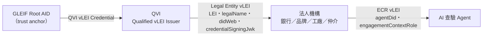

# vLEI Credential 信任層 Implementation Plan

> **For agentic workers:** REQUIRED SUB-SKILL: Use superpowers:subagent-driven-development (recommended) or superpowers:executing-plans to implement this plan task-by-task. Steps use checkbox (`- [ ]`) syntax for tracking.

**Goal:** 把機構信任層從手動維護的 `knownInstitutions` 公鑰名單，改成 GLEIF vLEI 生態系的憑證鏈（GLEIF Root → QVI → Legal Entity vLEI → ECR），機構身分與 Agent 授權全部經 vLEI credential 鏈驗證。

**Architecture:** 新增 `@eas/vlei` 套件，在 repo 內實作 KERI/ACDC-lite——CESR matter 編碼、Blake3-256 SAID、帶 pre-rotation 的 KEL、TEL 憑證註冊表（vcp/iss/rev）、ACDC 簽發與驗證、ISO 17442 LEI 檢核、四張 vLEI schema profile（QVI／LE／OOR／ECR）與信任鏈驗證。勞工面的四張 SD-JWT 憑證**完全不動**（原則二依賴選擇性揭露）；vLEI 只接管「機構是誰、Agent 憑什麼」這一層：L0 要求 Agent 出示 ECR 鏈，DelegationCredential SD-JWT 的驗簽金鑰改由 LE vLEI credential 內的 `credentialSigningJwk` 提供；L1 的 issuer 公鑰改由已驗證的 LE 鏈解出。

**Tech Stack:** TypeScript（ESM、無 build step、vitest alias 直指 src）、`@noble/hashes`（blake3，已在 shared 依賴中）、`@noble/curves`（ed25519，新增）、既有 `@sd-jwt/*` 不變。純 JS 同構——不引入 KERIA／witness 等外部服務，保住 fully static browser build。

## Global Constraints

- Node `>=22`（root package.json engines，不動）。
- 新增 runtime 依賴僅限 `@noble/curves@^1.9.0`；`@noble/hashes` 沿用 `^1.8.0`。不得引入 signify-ts、KERIA client、ajv 或任何其他套件。
- CLAUDE.md 三原則不可違反：原則一禁止函式（`approveAccount` 等）不得出現；原則二勞工原始欄位只能在 SD-JWT `_sd` 裡；原則三全部合成資料放 `fixtures/` 或測試內、DID 用 `did:web:*.example`、LEI 一律用 `syntheticLei()` 產生。
- 命名：憑證型別 PascalCase + `Credential` 結尾；原因碼 SCREAMING_SNAKE_CASE 且先登錄 CLAUDE.md 表格（本計畫 Task 9 處理）。
- 文件繁體中文；程式碼註解、識別字、commit message 英文。
- `poc/` 兩支腳本一行都不能改。
- 每個 task 結束時 `npx vitest run` 全綠、`npm run typecheck` 無錯誤才能 commit。
- 不得加測試後門（無 bypass flag、無 `NODE_ENV==='test'` 放行）。
- 錯誤訊息只帶原因碼／failure 代碼，不得帶被隱藏的欄位值。

## 規格對應與明文簡化（寫進 docs/vlei.md，Task 9）

忠實實作：CESR matter codes `E`（Blake3-256 SAID）／`D`（Ed25519 verfer）／`0B`（Ed25519 sig）、KERI version string 兩段式 sizing（`KERI10JSON{size}_`／`ACDC10JSON{size}_`）、SAID 自我定址（含 icp 的 `d`+`i` 雙標籤與 schema 的 `$id` 標籤）、KEL pre-rotation（`n` 承諾下一把鑰匙）、TEL `vcp`/`iss`/`rev`、ACDC `v/d/i/ri/s/a/e/r` 區塊與巢狀 SAID、官方 credentialType 名稱與官方 rules 條文、ISO 17442 mod 97-10 檢查碼。

明文簡化（PoC profile）：單簽 KEL（`kt:'1'`）、無 witness／OOBI／CESR stream（簽章放 JSON envelope、KEL/TEL 以 in-process store 共享）、schema SAID 為本 repo 自算（非 GLEIF 官方登錄之 SAID）、LE schema 擴充 `didWeb`+`credentialSigningJwk`、ECR schema 擴充 `agentDid`（橋接 SD-JWT 世界所需，官方 schema 無此欄位）。

## File Structure

```
packages/vlei/                          # 新套件 @eas/vlei
  package.json
  src/cesr.ts                           # CESR matter encode/decode（E/D/0B）
  src/said.ts                           # versify + saidify + verifySaid
  src/kel.ts                            # createAid / rotate / verifyKel / KelStore（pre-rotation）
  src/lei.ts                            # ISO 17442 check digits / isValidLei / syntheticLei
  src/tel.ts                            # CredentialRegistry（vcp/iss/rev）+ TelStore
  src/schemas.ts                        # QVI/LE/OOR/ECR schema profiles + VLEI_RULES
  src/acdc.ts                           # issueAcdc / verifyAcdc
  src/chain.ts                          # verifyLeChain / verifyEcrChain / VleiFailure / 型別
  src/ecosystem.ts                      # bootstrapEcosystem（GLEIF→QVI→LE→ECR）
  src/index.ts
  test/*.test.ts                        # 各模組測試
packages/shared/src/reasonCodes.ts      # 修改：新增 6 個 vLEI 原因碼
packages/issuer/src/issuer.ts           # 修改：新增 createVleiIssuer（createIssuer 保留為內部基底）
packages/issuer/src/index.ts            # 修改：re-export
packages/agents/src/vleiBridge.ts       # 新增：VleiFailure → ReasonCode、resolveAgentAuthority、resolveIssuerSigningKey
packages/agents/src/delegationGate.ts   # 修改：knownInstitutions → agentVlei + trust
packages/agents/src/index.ts            # 修改：re-export bridge
packages/agents/test/helpers/vleiWorld.ts  # 新增：測試共用 ecosystem 建構
packages/agents/test/delegation.test.ts     # 修改
packages/agents/test/revocationPaths.test.ts # 修改（knownInstitutions 消費者）
packages/agents/test/vleiEndToEnd.test.ts   # 新增：E2E + 撤銷級聯
packages/web/src/wallet/reviewDelegation.ts # 修改：options 換 agentVlei/trust，view 加 verifiedLegalEntity
packages/web/src/demo/world.ts              # 修改：ecosystem 接線
packages/web/test/walletDelegationCheck.test.ts # 修改
vitest.config.ts                        # 修改：alias @eas/vlei
CLAUDE.md                               # 修改：原因碼表
docs/vlei.md                            # 新增：vLEI 層規格
README.md                               # 修改：架構段補 vLEI
```

`knownInstitutions` 現有消費者（Task 12 一次清光）：`packages/agents/src/delegationGate.ts`、`packages/agents/test/delegation.test.ts`、`packages/agents/test/revocationPaths.test.ts`、`packages/web/src/demo/world.ts`、`packages/web/src/wallet/reviewDelegation.ts`、`packages/web/test/walletDelegationCheck.test.ts`。

---

### Task 1: `@eas/vlei` 套件骨架 + CESR matter 編碼

**Files:**
- Create: `packages/vlei/package.json`
- Create: `packages/vlei/src/cesr.ts`
- Create: `packages/vlei/src/index.ts`
- Modify: `vitest.config.ts`（alias）
- Test: `packages/vlei/test/cesr.test.ts`

**Interfaces:**
- Consumes: `@eas/shared` 的 `bytesToBase64url`。
- Produces: `MATTER_CODES`、`encodeMatter(code: string, raw: Uint8Array): string`、`decodeMatter(qb64: string): { code: string; raw: Uint8Array }`。後續所有模組的 qb64 編碼都經這裡。

- [ ] **Step 1: 建套件骨架與 alias**

`packages/vlei/package.json`：

```json
{
  "name": "@eas/vlei",
  "version": "0.1.0",
  "private": true,
  "type": "module",
  "exports": {
    ".": "./src/index.ts"
  },
  "dependencies": {
    "@eas/shared": "*",
    "@noble/curves": "^1.9.0",
    "@noble/hashes": "^1.8.0"
  }
}
```

`vitest.config.ts` 的 alias 區塊加一行（放在 `'@eas/shared'` 之後）：

```ts
      '@eas/vlei': r('./packages/vlei/src/index.ts'),
```

`packages/vlei/src/index.ts` 先只有：

```ts
export { MATTER_CODES, encodeMatter, decodeMatter } from './cesr.js';
```

執行 `npm install`（workspace 會拉入 @noble/curves）。

- [ ] **Step 2: 寫 failing test**

`packages/vlei/test/cesr.test.ts`：

```ts
import { describe, expect, test } from 'vitest';
import { MATTER_CODES, decodeMatter, encodeMatter } from '@eas/vlei';

function filled(length: number, seed: number): Uint8Array {
  return Uint8Array.from({ length }, (_, i) => (i * 7 + seed) % 256);
}

describe('CESR matter encoding', () => {
  test('a 32-byte digest round-trips through code E with length 44', () => {
    const raw = filled(32, 3);
    const qb64 = encodeMatter(MATTER_CODES.Blake3_256, raw);

    expect(qb64).toHaveLength(44);
    expect(qb64.startsWith('E')).toBe(true);
    expect(decodeMatter(qb64)).toEqual({ code: 'E', raw });
  });

  test('a 32-byte Ed25519 verfer round-trips through code D', () => {
    const raw = filled(32, 11);
    const qb64 = encodeMatter(MATTER_CODES.Ed25519, raw);

    expect(qb64).toHaveLength(44);
    expect(qb64.startsWith('D')).toBe(true);
    expect(decodeMatter(qb64).raw).toEqual(raw);
  });

  test('a 64-byte signature round-trips through code 0B with length 88', () => {
    const raw = filled(64, 5);
    const qb64 = encodeMatter(MATTER_CODES.Ed25519_Sig, raw);

    expect(qb64).toHaveLength(88);
    expect(qb64.startsWith('0B')).toBe(true);
    expect(decodeMatter(qb64)).toEqual({ code: '0B', raw });
  });

  test('encoding rejects a raw size that does not match the code', () => {
    expect(() => encodeMatter('E', filled(31, 0))).toThrow();
    expect(() => encodeMatter('0B', filled(32, 0))).toThrow();
  });

  test('decoding rejects an unknown code', () => {
    expect(() => decodeMatter('Z'.repeat(44))).toThrow();
  });
});
```

- [ ] **Step 3: 跑測試，確認 fail**

Run: `npx vitest run packages/vlei/test/cesr.test.ts`
Expected: FAIL（cesr.ts 不存在／export 缺失）

- [ ] **Step 4: 實作 `packages/vlei/src/cesr.ts`**

```ts
/**
 * CESR "matter" primitives — the qualified base64url text domain of KERI.
 *
 * Only the three codes this project needs are implemented: Blake3-256 digests
 * ('E', which is also the SAID code), Ed25519 verifier keys ('D') and Ed25519
 * signatures ('0B'). Encoding follows the CESR pad rule: prepend as many zero
 * bytes as the code has characters, base64url-encode, then overwrite the pad
 * characters with the code.
 */

import { bytesToBase64url } from '@eas/shared';

export const MATTER_CODES = {
  Blake3_256: 'E',
  Ed25519: 'D',
  Ed25519_Sig: '0B',
} as const;

const CODE_RAW_SIZE: Readonly<Record<string, number>> = {
  E: 32,
  D: 32,
  '0B': 64,
};

function base64urlToBytes(text: string): Uint8Array {
  const b64 = text.replace(/-/g, '+').replace(/_/g, '/');
  const padded = b64.padEnd(Math.ceil(b64.length / 4) * 4, '=');
  const binary = atob(padded);
  const out = new Uint8Array(binary.length);
  for (let i = 0; i < binary.length; i++) out[i] = binary.charCodeAt(i);
  return out;
}

export function encodeMatter(code: string, raw: Uint8Array): string {
  const expected = CODE_RAW_SIZE[code];
  if (expected === undefined) throw new Error(`unknown matter code: ${code}`);
  if (raw.length !== expected) {
    throw new Error(`matter code ${code} expects ${expected} raw bytes, got ${raw.length}`);
  }

  const padSize = (3 - (raw.length % 3)) % 3;
  if (padSize !== code.length) {
    throw new Error(`matter code ${code} is incompatible with a ${raw.length}-byte raw value`);
  }

  const padded = new Uint8Array(padSize + raw.length);
  padded.set(raw, padSize);

  return code + bytesToBase64url(padded).slice(code.length);
}

export function decodeMatter(qb64: string): { code: string; raw: Uint8Array } {
  const code = qb64.startsWith('0') ? qb64.slice(0, 2) : qb64.slice(0, 1);
  if (CODE_RAW_SIZE[code] === undefined) throw new Error(`unknown matter code: ${code}`);

  const padded = base64urlToBytes('A'.repeat(code.length) + qb64.slice(code.length));

  return { code, raw: padded.slice(code.length) };
}
```

注意：`bytesToBase64url` 若在 shared 的實作會去掉 `=` padding，本模組不受影響（qb64 長度固定 44/88，無殘餘 padding）。

- [ ] **Step 5: 跑測試，確認 pass**

Run: `npx vitest run packages/vlei/test/cesr.test.ts`
Expected: PASS（5 tests）

- [ ] **Step 6: typecheck + commit**

```bash
npm run typecheck
git add packages/vlei vitest.config.ts package.json package-lock.json
git commit -m "feat(vlei): package scaffold and CESR matter encoding"
```

---

### Task 2: KERI 序列化 + SAID（saidify / verifySaid / versify）

**Files:**
- Create: `packages/vlei/src/said.ts`
- Modify: `packages/vlei/src/index.ts`
- Test: `packages/vlei/test/said.test.ts`

**Interfaces:**
- Consumes: Task 1 的 `encodeMatter`；`@eas/shared` 的 `utf8ToBytes`；`@noble/hashes/blake3`。
- Produces: `type Ked = Record<string, unknown>`、`SAID_DUMMY`、`versify(proto: 'KERI' | 'ACDC', size: number): string`、`saidify<T extends Ked>(ked: T, labels?: readonly string[]): T`、`verifySaid(ked: Ked, labels?: readonly string[]): boolean`。**呼叫規約**：含 `v` 欄位的 ked 由呼叫端先放 `versify(proto, 0)` 佔位；saidify 會回填正確 size。標籤欄位（`d`、`i`、`$id`）值在輸入時可為任意字串，saidify 一律覆寫。

- [ ] **Step 1: 寫 failing test**

`packages/vlei/test/said.test.ts`：

```ts
import { describe, expect, test } from 'vitest';
import { utf8ToBytes } from '@eas/shared';
import { saidify, verifySaid, versify } from '@eas/vlei';

describe('SAID computation', () => {
  test('saidify fills the d label with a 44-char E-prefixed digest and verifySaid accepts it', () => {
    const ked = saidify({ v: versify('KERI', 0), t: 'icp', d: '', s: '0', k: ['DAAA'] });

    expect(ked.d).toHaveLength(44);
    expect(String(ked.d).startsWith('E')).toBe(true);
    expect(verifySaid(ked)).toBe(true);
  });

  test('the version string size field matches the actual serialized length', () => {
    const ked = saidify({ v: versify('KERI', 0), t: 'icp', d: '', s: '0', k: ['DAAA'] });
    const size = parseInt(String(ked.v).slice('KERI10JSON'.length, -1), 16);

    expect(size).toBe(utf8ToBytes(JSON.stringify(ked)).length);
  });

  test('saidify is deterministic and content-sensitive', () => {
    const a = saidify({ v: versify('ACDC', 0), d: '', x: 1 });
    const b = saidify({ v: versify('ACDC', 0), d: '', x: 1 });
    const c = saidify({ v: versify('ACDC', 0), d: '', x: 2 });

    expect(a.d).toBe(b.d);
    expect(a.d).not.toBe(c.d);
  });

  test('mutating any field after saidify breaks verification', () => {
    const ked = saidify({ v: versify('KERI', 0), t: 'icp', d: '', s: '0', k: ['DAAA'] });

    expect(verifySaid({ ...ked, s: '1' })).toBe(false);
    expect(verifySaid({ ...ked, d: 'E' + 'A'.repeat(43) })).toBe(false);
  });

  test('multi-label saidify (icp d+i, schema $id) sets every label to the same digest', () => {
    const icp = saidify({ v: versify('KERI', 0), t: 'icp', d: '', i: '', s: '0' }, ['d', 'i']);
    const schema = saidify({ $id: '', title: 'X' }, ['$id']);

    expect(icp.d).toBe(icp.i);
    expect(verifySaid(icp, ['d', 'i'])).toBe(true);
    expect(verifySaid(schema, ['$id'])).toBe(true);
  });

  test('a ked without a v field (nested blocks) still gets a stable said', () => {
    const block = saidify({ d: '', i: 'did:key:zWorker001', dt: '2026-08-04T00:00:00Z' });

    expect(verifySaid(block)).toBe(true);
  });
});
```

- [ ] **Step 2: 跑測試，確認 fail**

Run: `npx vitest run packages/vlei/test/said.test.ts`
Expected: FAIL

- [ ] **Step 3: 實作 `packages/vlei/src/said.ts`**

```ts
/**
 * Self-Addressing IDentifiers (SAID) over KERI-style serializations.
 *
 * The two-pass rule: set every said label to a 44-char dummy, fix the version
 * string size against that dummy serialization (the real digest has the same
 * length, so the size is stable), digest with Blake3-256, then fill the labels.
 * Verification re-runs the same passes and compares.
 */

import { blake3 } from '@noble/hashes/blake3';
import { utf8ToBytes } from '@eas/shared';
import { MATTER_CODES, encodeMatter } from './cesr.js';

export type Ked = Record<string, unknown>;

export const SAID_DUMMY = '#'.repeat(44);

export function versify(proto: 'KERI' | 'ACDC', size: number): string {
  return `${proto}10JSON${size.toString(16).padStart(6, '0')}_`;
}

function dummied(ked: Ked, labels: readonly string[]): Ked {
  const working: Ked = { ...ked };
  for (const label of labels) working[label] = SAID_DUMMY;

  const version = ked['v'];
  if (typeof version === 'string') {
    const proto = version.startsWith('ACDC') ? 'ACDC' : 'KERI';
    working['v'] = versify(proto, 0);
    working['v'] = versify(proto, utf8ToBytes(JSON.stringify(working)).length);
  }

  return working;
}

export function saidify<T extends Ked>(ked: T, labels: readonly string[] = ['d']): T {
  const working = dummied(ked, labels);
  const digest = blake3(utf8ToBytes(JSON.stringify(working)), { dkLen: 32 });
  const said = encodeMatter(MATTER_CODES.Blake3_256, digest);

  const out: Ked = { ...working };
  for (const label of labels) out[label] = said;

  return out as T;
}

export function verifySaid(ked: Ked, labels: readonly string[] = ['d']): boolean {
  const first = labels[0];
  if (first === undefined) return false;

  const said = ked[first];
  if (typeof said !== 'string') return false;
  if (!labels.every((label) => ked[label] === said)) return false;

  const recomputed = saidify(ked, labels);
  return recomputed[first] === said && JSON.stringify(recomputed) === JSON.stringify(ked);
}
```

`packages/vlei/src/index.ts` 追加：

```ts
export { SAID_DUMMY, saidify, verifySaid, versify } from './said.js';
export type { Ked } from './said.js';
```

- [ ] **Step 4: 跑測試，確認 pass**

Run: `npx vitest run packages/vlei/test/said.test.ts`
Expected: PASS（6 tests）

- [ ] **Step 5: typecheck + commit**

```bash
npm run typecheck
git add packages/vlei
git commit -m "feat(vlei): KERI version string and Blake3 SAID computation"
```

---

### Task 3: AID / KEL（pre-rotation）與 KelStore

**Files:**
- Create: `packages/vlei/src/kel.ts`
- Modify: `packages/vlei/src/index.ts`
- Test: `packages/vlei/test/kel.test.ts`

**Interfaces:**
- Consumes: Task 1–2 全部；`@noble/curves/ed25519`。
- Produces:
  - `createKeyMaterial(): { verfer: string; secret: Uint8Array }`
  - `interface KelEvent { v; t: 'icp' | 'rot'; d; i; s; p?; kt; k: readonly string[]; nt; n: readonly string[]; bt; b?; br?; ba?; c?; a }`
  - `interface SignedKelEvent { event: KelEvent; sig: string }`
  - `interface AidController { aid: string; kel: readonly SignedKelEvent[]; currentVerfer(): string; sign(data: Uint8Array): { sig: string; sigSeq: number }; rotate(): void }`
  - `createAid(): AidController`、`verifyKel(kel): boolean`
  - `class KelStore { register(kel): void; verferAt(aid: string, seq: number): string | undefined }`
  - **關鍵語意**：`sign()` 回傳的 `sigSeq` 是當下 establishment event 的序號；`KelStore.register` 存活引用（controller 之後 rotate，store 立即可見）；`verferAt` 每次讀取都整條重驗，KEL 被竄改就回 `undefined`（fail closed）。

- [ ] **Step 1: 寫 failing test**

`packages/vlei/test/kel.test.ts`：

```ts
import { describe, expect, test } from 'vitest';
import { ed25519 } from '@noble/curves/ed25519';
import { utf8ToBytes } from '@eas/shared';
import {
  KelStore,
  createAid,
  createKeyMaterial,
  decodeMatter,
  verifyKel,
  type SignedKelEvent,
} from '@eas/vlei';

describe('AID inception and rotation', () => {
  test('inception yields a self-addressing AID whose KEL verifies', () => {
    const controller = createAid();

    expect(controller.aid).toBe(controller.kel[0]?.event.d);
    expect(controller.aid.startsWith('E')).toBe(true);
    expect(verifyKel(controller.kel)).toBe(true);
  });

  test('sign() binds a signature to the current establishment seq', () => {
    const controller = createAid();
    const data = utf8ToBytes('payload');
    const { sig, sigSeq } = controller.sign(data);

    expect(sigSeq).toBe(0);
    const verfer = decodeMatter(controller.currentVerfer()).raw;
    expect(ed25519.verify(decodeMatter(sig).raw, data, verfer)).toBe(true);
  });

  test('rotation honours the pre-rotation commitment and the KEL still verifies', () => {
    const controller = createAid();
    const before = controller.currentVerfer();
    controller.rotate();

    expect(controller.currentVerfer()).not.toBe(before);
    expect(controller.kel).toHaveLength(2);
    expect(verifyKel(controller.kel)).toBe(true);
  });

  test('KelStore resolves keys per establishment seq, across rotations', () => {
    const store = new KelStore();
    const controller = createAid();
    store.register(controller.kel);

    const first = controller.currentVerfer();
    controller.rotate();

    expect(store.verferAt(controller.aid, 0)).toBe(first);
    expect(store.verferAt(controller.aid, 1)).toBe(controller.currentVerfer());
    expect(store.verferAt(controller.aid, 9)).toBeUndefined();
  });

  test('a tampered KEL fails verification and the store fails closed', () => {
    const store = new KelStore();
    const controller = createAid();
    store.register(controller.kel);

    const forged = createKeyMaterial();
    const kel = controller.kel as SignedKelEvent[];
    const icp = kel[0]!;
    kel[0] = { ...icp, event: { ...icp.event, k: [forged.verfer] } };

    expect(verifyKel(kel)).toBe(false);
    expect(store.verferAt(controller.aid, 0)).toBeUndefined();
  });

  test('a rotation that breaks the pre-rotation commitment is rejected', () => {
    const controller = createAid();
    controller.rotate();

    const kel = controller.kel as SignedKelEvent[];
    const rot = kel[1]!;
    const stranger = createKeyMaterial();
    kel[1] = { ...rot, event: { ...rot.event, k: [stranger.verfer] } };

    expect(verifyKel(kel)).toBe(false);
  });
});
```

- [ ] **Step 2: 跑測試，確認 fail**

Run: `npx vitest run packages/vlei/test/kel.test.ts`
Expected: FAIL

- [ ] **Step 3: 實作 `packages/vlei/src/kel.ts`**

```ts
/**
 * Single-signature KERI key event logs with pre-rotation.
 *
 * An AID is the SAID of its inception event. Every rotation must present keys
 * whose digest was committed in the previous establishment event's `n` field,
 * so a key compromised today cannot rewrite tomorrow's history. No witnesses,
 * no delegation — documented PoC simplifications.
 */

import { ed25519 } from '@noble/curves/ed25519';
import { blake3 } from '@noble/hashes/blake3';
import { utf8ToBytes } from '@eas/shared';
import { MATTER_CODES, decodeMatter, encodeMatter } from './cesr.js';
import { saidify, verifySaid, versify, type Ked } from './said.js';

export interface KeyMaterial {
  readonly verfer: string;
  readonly secret: Uint8Array;
}

export function createKeyMaterial(): KeyMaterial {
  const secret = ed25519.utils.randomPrivateKey();
  return { secret, verfer: encodeMatter(MATTER_CODES.Ed25519, ed25519.getPublicKey(secret)) };
}

function digestOfQb64(qb64: string): string {
  return encodeMatter(MATTER_CODES.Blake3_256, blake3(utf8ToBytes(qb64), { dkLen: 32 }));
}

export interface KelEvent {
  readonly v: string;
  readonly t: 'icp' | 'rot';
  readonly d: string;
  readonly i: string;
  readonly s: string;
  readonly p?: string;
  readonly kt: string;
  readonly k: readonly string[];
  readonly nt: string;
  readonly n: readonly string[];
  readonly bt: string;
  readonly b?: readonly string[];
  readonly br?: readonly string[];
  readonly ba?: readonly string[];
  readonly c?: readonly string[];
  readonly a: readonly unknown[];
}

export interface SignedKelEvent {
  readonly event: KelEvent;
  readonly sig: string;
}

export interface AidController {
  readonly aid: string;
  readonly kel: readonly SignedKelEvent[];
  currentVerfer(): string;
  sign(data: Uint8Array): { sig: string; sigSeq: number };
  rotate(): void;
}

function signEvent(event: Ked, secret: Uint8Array): string {
  return encodeMatter(
    MATTER_CODES.Ed25519_Sig,
    ed25519.sign(utf8ToBytes(JSON.stringify(event)), secret),
  );
}

export function createAid(): AidController {
  let current = createKeyMaterial();
  let next = createKeyMaterial();
  const kel: SignedKelEvent[] = [];

  const icp = saidify(
    {
      v: versify('KERI', 0),
      t: 'icp' as const,
      d: '',
      i: '',
      s: '0',
      kt: '1',
      k: [current.verfer],
      nt: '1',
      n: [digestOfQb64(next.verfer)],
      bt: '0',
      b: [],
      c: [],
      a: [],
    },
    ['d', 'i'],
  );
  kel.push({ event: icp as unknown as KelEvent, sig: signEvent(icp, current.secret) });

  return {
    aid: icp.i,
    kel,
    currentVerfer: () => current.verfer,

    sign(data) {
      const latest = kel[kel.length - 1]!.event;
      return {
        sig: encodeMatter(MATTER_CODES.Ed25519_Sig, ed25519.sign(data, current.secret)),
        sigSeq: parseInt(latest.s, 16),
      };
    },

    rotate() {
      const upcoming = createKeyMaterial();
      const prior = kel[kel.length - 1]!.event;
      const rot = saidify({
        v: versify('KERI', 0),
        t: 'rot' as const,
        d: '',
        i: icp.i,
        s: (parseInt(prior.s, 16) + 1).toString(16),
        p: prior.d,
        kt: '1',
        k: [next.verfer],
        nt: '1',
        n: [digestOfQb64(upcoming.verfer)],
        bt: '0',
        br: [],
        ba: [],
        a: [],
      });

      // KERI rotation is signed by the newly-current keys.
      current = next;
      next = upcoming;
      kel.push({ event: rot as unknown as KelEvent, sig: signEvent(rot, current.secret) });
    },
  };
}

function signatureValid(signed: SignedKelEvent): boolean {
  const verfer = signed.event.k[0];
  if (verfer === undefined) return false;

  return ed25519.verify(
    decodeMatter(signed.sig).raw,
    utf8ToBytes(JSON.stringify(signed.event)),
    decodeMatter(verfer).raw,
  );
}

export function verifyKel(kel: readonly SignedKelEvent[]): boolean {
  const first = kel[0];
  if (first === undefined) return false;

  const icp = first.event;
  if (icp.t !== 'icp' || icp.s !== '0' || icp.i !== icp.d) return false;
  if (!verifySaid(icp as unknown as Ked, ['d', 'i'])) return false;
  if (!signatureValid(first)) return false;

  for (let at = 1; at < kel.length; at++) {
    const prev = kel[at - 1]!.event;
    const signed = kel[at]!;
    const rot = signed.event;

    if (rot.t !== 'rot' || rot.i !== icp.i) return false;
    if (parseInt(rot.s, 16) !== parseInt(prev.s, 16) + 1) return false;
    if (rot.p !== prev.d) return false;
    if (!verifySaid(rot as unknown as Ked)) return false;

    // Pre-rotation: the new key must have been committed by the prior event.
    const newKey = rot.k[0];
    if (newKey === undefined || digestOfQb64(newKey) !== prev.n[0]) return false;
    if (!signatureValid(signed)) return false;
  }

  return true;
}

export class KelStore {
  private readonly kels = new Map<string, readonly SignedKelEvent[]>();

  /** Registers a live reference: later rotations by the controller are visible. */
  register(kel: readonly SignedKelEvent[]): void {
    const aid = kel[0]?.event.i;
    if (aid === undefined || !verifyKel(kel)) {
      throw new Error('refusing to register an invalid KEL');
    }
    this.kels.set(aid, kel);
  }

  /** Re-verifies the whole KEL on every read; a tampered log resolves nothing. */
  verferAt(aid: string, seq: number): string | undefined {
    const kel = this.kels.get(aid);
    if (kel === undefined || !verifyKel(kel)) return undefined;

    const establishment = kel.find((signed) => parseInt(signed.event.s, 16) === seq);
    return establishment?.event.k[0];
  }
}
```

`packages/vlei/src/index.ts` 追加：

```ts
export {
  KelStore,
  createAid,
  createKeyMaterial,
  verifyKel,
} from './kel.js';
export type { AidController, KelEvent, KeyMaterial, SignedKelEvent } from './kel.js';
```

- [ ] **Step 4: 跑測試，確認 pass**

Run: `npx vitest run packages/vlei/test/kel.test.ts`
Expected: PASS（6 tests）

- [ ] **Step 5: typecheck + commit**

```bash
npm run typecheck
git add packages/vlei
git commit -m "feat(vlei): AID key event logs with pre-rotation and KelStore"
```

---

### Task 4: ISO 17442 LEI 工具

**Files:**
- Create: `packages/vlei/src/lei.ts`
- Modify: `packages/vlei/src/index.ts`
- Test: `packages/vlei/test/lei.test.ts`

**Interfaces:**
- Produces: `computeLeiCheckDigits(base18: string): string`、`isValidLei(lei: string): boolean`、`syntheticLei(tag: string): string`（tag 限 `[A-Z0-9]{1,18}`，右補 `X` 到 18 碼再接檢查碼——合成 LEI 一律經此產生，符合原則三）。

- [ ] **Step 1: 寫 failing test**

`packages/vlei/test/lei.test.ts`：

```ts
import { describe, expect, test } from 'vitest';
import { computeLeiCheckDigits, isValidLei, syntheticLei } from '@eas/vlei';

describe('ISO 17442 LEI', () => {
  test('a synthetic LEI is 20 chars and passes mod 97-10 validation', () => {
    const lei = syntheticLei('BANKEXAMPLE');

    expect(lei).toHaveLength(20);
    expect(lei.startsWith('BANKEXAMPLEXXXXXXX')).toBe(true);
    expect(isValidLei(lei)).toBe(true);
  });

  test('check digits are consistent between compute and validate', () => {
    const base = 'AGENCYEXAMPLEXXXXX';
    const lei = base + computeLeiCheckDigits(base);

    expect(isValidLei(lei)).toBe(true);
  });

  test('corrupting any character breaks validation', () => {
    const lei = syntheticLei('FACTORYEXAMPLE');
    const corrupted = (lei[0] === 'A' ? 'B' : 'A') + lei.slice(1);

    expect(isValidLei(corrupted)).toBe(false);
  });

  test('shape violations are rejected', () => {
    expect(isValidLei('short')).toBe(false);
    expect(isValidLei('bankexamplexxxxxxx00')).toBe(false);
    expect(isValidLei('BANKEXAMPLEXXXXXXXAA')).toBe(false);
  });

  test('syntheticLei rejects tags that cannot form a valid base', () => {
    expect(() => syntheticLei('')).toThrow();
    expect(() => syntheticLei('lower')).toThrow();
    expect(() => syntheticLei('X'.repeat(19))).toThrow();
  });
});
```

- [ ] **Step 2: 跑測試，確認 fail**

Run: `npx vitest run packages/vlei/test/lei.test.ts`
Expected: FAIL

- [ ] **Step 3: 實作 `packages/vlei/src/lei.ts`**

```ts
/**
 * ISO 17442 LEI check digits (ISO/IEC 7064 mod 97-10), plus a synthetic-LEI
 * factory so fixtures never resemble a real registered entity.
 */

function charValue(char: string): string {
  if (char >= '0' && char <= '9') return char;
  return String(char.charCodeAt(0) - 'A'.charCodeAt(0) + 10);
}

function mod97(digits: string): number {
  let acc = 0;
  for (const digit of digits) acc = (acc * 10 + (digit.charCodeAt(0) - 48)) % 97;
  return acc;
}

function expand(text: string): string {
  return text.split('').map(charValue).join('');
}

export function computeLeiCheckDigits(base18: string): string {
  if (!/^[A-Z0-9]{18}$/.test(base18)) {
    throw new Error('LEI base must be 18 chars of A-Z0-9');
  }

  return String(98 - mod97(expand(base18 + '00'))).padStart(2, '0');
}

export function isValidLei(lei: string): boolean {
  if (!/^[A-Z0-9]{18}[0-9]{2}$/.test(lei)) return false;
  return mod97(expand(lei)) === 1;
}

/** Synthetic LEIs are visibly fake: tag padded with X to 18, valid check digits. */
export function syntheticLei(tag: string): string {
  if (!/^[A-Z0-9]{1,18}$/.test(tag)) {
    throw new Error('synthetic LEI tag must be 1-18 chars of A-Z0-9');
  }

  const base = tag.padEnd(18, 'X');
  return base + computeLeiCheckDigits(base);
}
```

`packages/vlei/src/index.ts` 追加：

```ts
export { computeLeiCheckDigits, isValidLei, syntheticLei } from './lei.js';
```

- [ ] **Step 4: 跑測試，確認 pass**

Run: `npx vitest run packages/vlei/test/lei.test.ts`
Expected: PASS（5 tests）

- [ ] **Step 5: typecheck + commit**

```bash
npm run typecheck
git add packages/vlei
git commit -m "feat(vlei): ISO 17442 LEI check digits and synthetic LEI factory"
```

---

### Task 5: TEL 憑證註冊表（vcp / iss / rev）

**Files:**
- Create: `packages/vlei/src/tel.ts`
- Modify: `packages/vlei/src/index.ts`
- Test: `packages/vlei/test/tel.test.ts`

**Interfaces:**
- Consumes: Task 2 的 saidify/versify、Task 3 的 `AidController`、`KelStore`、`decodeMatter`。
- Produces:
  - `interface TelEvent { v; t: 'vcp' | 'iss' | 'rev'; d; i; s; ri?; ii?; p?; dt }`
  - `interface SignedTelEvent { event: TelEvent; sig: string; sigSeq: number }`
  - `class CredentialRegistry { constructor(controller: AidController, dt?: string); readonly registryId: string; readonly events: readonly SignedTelEvent[]; issue(credentialSaid: string, dt?: string): void; revoke(credentialSaid: string, dt?: string): void }`
  - `type CredentialStatus = 'issued' | 'revoked' | 'unknown'`
  - `class TelStore { constructor(kels: KelStore); register(registry: CredentialRegistry): void; status(registryId: string, credentialSaid: string): CredentialStatus }`
  - **關鍵語意**：`status` 逐事件重驗 SAID＋控制者簽章（經 KelStore 解 `sigSeq` 對應 verfer），任何一筆驗不過整個 registry fail closed 回 `unknown`。

- [ ] **Step 1: 寫 failing test**

`packages/vlei/test/tel.test.ts`：

```ts
import { describe, expect, test } from 'vitest';
import {
  CredentialRegistry,
  KelStore,
  TelStore,
  createAid,
  type SignedTelEvent,
} from '@eas/vlei';

function setup() {
  const kels = new KelStore();
  const tels = new TelStore(kels);
  const controller = createAid();
  kels.register(controller.kel);
  const registry = new CredentialRegistry(controller);
  tels.register(registry);
  return { kels, tels, controller, registry };
}

const CRED_SAID = 'E' + 'B'.repeat(43);

describe('TEL credential registry', () => {
  test('an unissued credential is unknown', () => {
    const { tels, registry } = setup();

    expect(tels.status(registry.registryId, CRED_SAID)).toBe('unknown');
  });

  test('issue then status reports issued', () => {
    const { tels, registry } = setup();
    registry.issue(CRED_SAID);

    expect(tels.status(registry.registryId, CRED_SAID)).toBe('issued');
  });

  test('revoke flips the status and cannot be undone by re-reading', () => {
    const { tels, registry } = setup();
    registry.issue(CRED_SAID);
    registry.revoke(CRED_SAID);

    expect(tels.status(registry.registryId, CRED_SAID)).toBe('revoked');
  });

  test('revoking an unissued credential throws', () => {
    const { registry } = setup();

    expect(() => registry.revoke(CRED_SAID)).toThrow();
  });

  test('an unknown registry id is unknown', () => {
    const { tels } = setup();

    expect(tels.status('E' + 'C'.repeat(43), CRED_SAID)).toBe('unknown');
  });

  test('a tampered TEL event fails closed to unknown', () => {
    const { tels, registry } = setup();
    registry.issue(CRED_SAID);

    const events = registry.events as SignedTelEvent[];
    const last = events[events.length - 1]!;
    events[events.length - 1] = {
      ...last,
      event: { ...last.event, dt: '1999-01-01T00:00:00Z' },
    };

    expect(tels.status(registry.registryId, CRED_SAID)).toBe('unknown');
  });

  test('registry survives controller key rotation for later events', () => {
    const { tels, controller, registry } = setup();
    registry.issue(CRED_SAID);
    controller.rotate();
    const second = 'E' + 'D'.repeat(43);
    registry.issue(second);

    expect(tels.status(registry.registryId, CRED_SAID)).toBe('issued');
    expect(tels.status(registry.registryId, second)).toBe('issued');
  });
});
```

- [ ] **Step 2: 跑測試，確認 fail**

Run: `npx vitest run packages/vlei/test/tel.test.ts`
Expected: FAIL

- [ ] **Step 3: 實作 `packages/vlei/src/tel.ts`**

```ts
/**
 * Transaction Event Logs — the revocation backbone of ACDC credentials.
 *
 * A registry is incepted with `vcp`; each credential gets an `iss` and at most
 * one `rev`. Status is derived by replaying the log, verifying each event's
 * SAID and controller signature; a single bad event makes the whole registry
 * answer `unknown`, never `issued`.
 */

import { ed25519 } from '@noble/curves/ed25519';
import { utf8ToBytes } from '@eas/shared';
import { decodeMatter } from './cesr.js';
import { saidify, verifySaid, versify, type Ked } from './said.js';
import { KelStore, type AidController } from './kel.js';

export interface TelEvent {
  readonly v: string;
  readonly t: 'vcp' | 'iss' | 'rev';
  readonly d: string;
  readonly i: string;
  readonly s: string;
  readonly ri?: string;
  readonly ii?: string;
  readonly p?: string;
  readonly dt: string;
}

export interface SignedTelEvent {
  readonly event: TelEvent;
  readonly sig: string;
  readonly sigSeq: number;
}

export type CredentialStatus = 'issued' | 'revoked' | 'unknown';

export class CredentialRegistry {
  readonly registryId: string;
  readonly events: SignedTelEvent[] = [];

  constructor(
    private readonly controller: AidController,
    dt: string = new Date().toISOString(),
  ) {
    const vcp = saidify(
      { v: versify('KERI', 0), t: 'vcp' as const, d: '', i: '', ii: controller.aid, s: '0', dt },
      ['d', 'i'],
    );
    this.registryId = vcp.i;
    this.append(vcp as unknown as TelEvent);
  }

  private append(event: TelEvent): void {
    const { sig, sigSeq } = this.controller.sign(utf8ToBytes(JSON.stringify(event)));
    this.events.push({ event, sig, sigSeq });
  }

  issue(credentialSaid: string, dt: string = new Date().toISOString()): void {
    const iss = saidify({
      v: versify('KERI', 0),
      t: 'iss' as const,
      d: '',
      i: credentialSaid,
      s: '0',
      ri: this.registryId,
      dt,
    });
    this.append(iss as unknown as TelEvent);
  }

  revoke(credentialSaid: string, dt: string = new Date().toISOString()): void {
    const issuance = this.events.find(
      (signed) => signed.event.t === 'iss' && signed.event.i === credentialSaid,
    );
    if (issuance === undefined) {
      throw new Error('cannot revoke a credential this registry never issued');
    }

    const rev = saidify({
      v: versify('KERI', 0),
      t: 'rev' as const,
      d: '',
      i: credentialSaid,
      s: '1',
      ri: this.registryId,
      p: issuance.event.d,
      dt,
    });
    this.append(rev as unknown as TelEvent);
  }
}

export class TelStore {
  private readonly registries = new Map<string, CredentialRegistry>();

  constructor(private readonly kels: KelStore) {}

  register(registry: CredentialRegistry): void {
    this.registries.set(registry.registryId, registry);
  }

  status(registryId: string, credentialSaid: string): CredentialStatus {
    const registry = this.registries.get(registryId);
    if (registry === undefined) return 'unknown';

    const controllerAid = registry.events[0]?.event.ii;
    if (controllerAid === undefined) return 'unknown';

    let status: CredentialStatus = 'unknown';
    for (const signed of registry.events) {
      if (!this.eventValid(controllerAid, signed)) return 'unknown';
      if (signed.event.t === 'iss' && signed.event.i === credentialSaid) status = 'issued';
      if (signed.event.t === 'rev' && signed.event.i === credentialSaid) status = 'revoked';
    }

    return status;
  }

  private eventValid(controllerAid: string, signed: SignedTelEvent): boolean {
    const labels = signed.event.t === 'vcp' ? ['d', 'i'] : ['d'];
    if (!verifySaid(signed.event as unknown as Ked, labels)) return false;

    const verfer = this.kels.verferAt(controllerAid, signed.sigSeq);
    if (verfer === undefined) return false;

    return ed25519.verify(
      decodeMatter(signed.sig).raw,
      utf8ToBytes(JSON.stringify(signed.event)),
      decodeMatter(verfer).raw,
    );
  }
}
```

`packages/vlei/src/index.ts` 追加：

```ts
export { CredentialRegistry, TelStore } from './tel.js';
export type { CredentialStatus, SignedTelEvent, TelEvent } from './tel.js';
```

- [ ] **Step 4: 跑測試，確認 pass**

Run: `npx vitest run packages/vlei/test/tel.test.ts`
Expected: PASS（7 tests）

- [ ] **Step 5: typecheck + commit**

```bash
npm run typecheck
git add packages/vlei
git commit -m "feat(vlei): TEL credential registries with fail-closed status"
```

---

### Task 6: vLEI schema profiles + 官方 rules

**Files:**
- Create: `packages/vlei/src/schemas.ts`
- Modify: `packages/vlei/src/index.ts`
- Test: `packages/vlei/test/schemas.test.ts`

**Interfaces:**
- Consumes: Task 2 saidify/verifySaid。
- Produces:
  - `type VleiSchemaName = 'qvi' | 'legalEntity' | 'oor' | 'ecr'`
  - `interface VleiSchema { $id; $schema; title; description; credentialType; attributes: { required: readonly string[]; types: Readonly<Record<string, 'string' | 'object'>> } }`
  - `VLEI_SCHEMAS: Record<VleiSchemaName, VleiSchema>`、`schemaSaid(name): string`、`schemaBySaid(said): { name: VleiSchemaName; schema: VleiSchema } | undefined`、`validateAttributes(name, attrs: Record<string, unknown>): boolean`、`VLEI_RULES`（saidified 官方 usage/issuance disclaimer）。
  - credentialType 用官方名稱：`QualifiedvLEIIssuervLEICredential`、`LegalEntityvLEICredential`、`LegalEntityOfficialOrganizationalRolevLEICredential`、`LegalEntityEngagementContextRolevLEICredential`。

- [ ] **Step 1: 寫 failing test**

`packages/vlei/test/schemas.test.ts`：

```ts
import { describe, expect, test } from 'vitest';
import {
  VLEI_RULES,
  VLEI_SCHEMAS,
  schemaBySaid,
  schemaSaid,
  validateAttributes,
  verifySaid,
} from '@eas/vlei';

describe('vLEI schema profiles', () => {
  test('all four schemas carry a verifiable $id SAID and distinct ids', () => {
    const names = ['qvi', 'legalEntity', 'oor', 'ecr'] as const;
    const saids = names.map((name) => schemaSaid(name));

    for (const name of names) {
      expect(verifySaid(VLEI_SCHEMAS[name] as unknown as Record<string, unknown>, ['$id'])).toBe(
        true,
      );
    }
    expect(new Set(saids).size).toBe(4);
  });

  test('schemaBySaid inverts schemaSaid', () => {
    expect(schemaBySaid(schemaSaid('ecr'))?.name).toBe('ecr');
    expect(schemaBySaid('E' + 'F'.repeat(43))).toBeUndefined();
  });

  test('official credentialType names are used', () => {
    expect(VLEI_SCHEMAS.qvi.credentialType).toBe('QualifiedvLEIIssuervLEICredential');
    expect(VLEI_SCHEMAS.legalEntity.credentialType).toBe('LegalEntityvLEICredential');
    expect(VLEI_SCHEMAS.ecr.credentialType).toBe(
      'LegalEntityEngagementContextRolevLEICredential',
    );
  });

  test('validateAttributes enforces required keys and value kinds', () => {
    expect(
      validateAttributes('ecr', {
        LEI: 'BANKEXAMPLEXXXXXXX00',
        agentDid: 'did:key:zBankAgent',
        engagementContextRole: 'ai-verification-agent',
      }),
    ).toBe(true);
    expect(validateAttributes('ecr', { LEI: 'X', agentDid: 'did:key:zBankAgent' })).toBe(false);
    expect(
      validateAttributes('legalEntity', {
        LEI: 'X',
        legalName: 'Bank',
        didWeb: 'did:web:bank.example',
        credentialSigningJwk: 'not-an-object',
      }),
    ).toBe(false);
  });

  test('the rules block is saidified and carries both official disclaimers', () => {
    expect(verifySaid(VLEI_RULES as unknown as Record<string, unknown>)).toBe(true);
    expect(VLEI_RULES.usageDisclaimer.l).toContain('does not assert');
    expect(VLEI_RULES.issuanceDisclaimer.l).toContain('accurate as of');
  });
});
```

- [ ] **Step 2: 跑測試，確認 fail**

Run: `npx vitest run packages/vlei/test/schemas.test.ts`
Expected: FAIL

- [ ] **Step 3: 實作 `packages/vlei/src/schemas.ts`**

```ts
/**
 * PoC profiles of the four vLEI credential schemas. Official credentialType
 * names are kept; the $id is a SAID computed over this profile (not GLEIF's
 * registered SAID). Extension fields beyond the official schemas: legalEntity
 * carries didWeb + credentialSigningJwk and ecr carries agentDid — the bridge
 * that binds the KERI trust chain to this repo's SD-JWT world.
 */

import { saidify } from './said.js';

export type VleiSchemaName = 'qvi' | 'legalEntity' | 'oor' | 'ecr';

export interface AttributeSpec {
  readonly required: readonly string[];
  readonly types: Readonly<Record<string, 'string' | 'object'>>;
}

export interface VleiSchema {
  readonly $id: string;
  readonly $schema: string;
  readonly title: string;
  readonly description: string;
  readonly credentialType: string;
  readonly attributes: AttributeSpec;
}

function makeSchema(input: Omit<VleiSchema, '$id' | '$schema'>): VleiSchema {
  return saidify(
    {
      $id: '',
      $schema: 'http://json-schema.org/draft-07/schema#',
      ...input,
    },
    ['$id'],
  ) as unknown as VleiSchema;
}

export const VLEI_SCHEMAS: Record<VleiSchemaName, VleiSchema> = {
  qvi: makeSchema({
    title: 'Qualified vLEI Issuer Credential',
    description:
      'Issued by GLEIF to a Qualified vLEI Issuer, authorizing it to issue Legal Entity vLEI credentials. PoC profile.',
    credentialType: 'QualifiedvLEIIssuervLEICredential',
    attributes: { required: ['LEI'], types: { LEI: 'string' } },
  }),
  legalEntity: makeSchema({
    title: 'Legal Entity vLEI Credential',
    description:
      'Issued by a QVI to a Legal Entity. PoC profile; didWeb and credentialSigningJwk are extension fields binding the entity to its SD-JWT signing identity.',
    credentialType: 'LegalEntityvLEICredential',
    attributes: {
      required: ['LEI', 'legalName', 'didWeb', 'credentialSigningJwk'],
      types: {
        LEI: 'string',
        legalName: 'string',
        didWeb: 'string',
        credentialSigningJwk: 'object',
      },
    },
  }),
  oor: makeSchema({
    title: 'Legal Entity Official Organizational Role vLEI Credential',
    description: 'Issued to a person holding an official role at a Legal Entity. PoC profile.',
    credentialType: 'LegalEntityOfficialOrganizationalRolevLEICredential',
    attributes: {
      required: ['LEI', 'personLegalName', 'officialRole'],
      types: { LEI: 'string', personLegalName: 'string', officialRole: 'string' },
    },
  }),
  ecr: makeSchema({
    title: 'Legal Entity Engagement Context Role vLEI Credential',
    description:
      'Issued by a Legal Entity for a context-specific role. PoC profile; agentDid is an extension field naming the AI agent this role empowers.',
    credentialType: 'LegalEntityEngagementContextRolevLEICredential',
    attributes: {
      required: ['LEI', 'agentDid', 'engagementContextRole'],
      types: { LEI: 'string', agentDid: 'string', engagementContextRole: 'string' },
    },
  }),
};

export function schemaSaid(name: VleiSchemaName): string {
  return VLEI_SCHEMAS[name].$id;
}

export function schemaBySaid(
  said: string,
): { name: VleiSchemaName; schema: VleiSchema } | undefined {
  for (const name of Object.keys(VLEI_SCHEMAS) as VleiSchemaName[]) {
    if (VLEI_SCHEMAS[name].$id === said) return { name, schema: VLEI_SCHEMAS[name] };
  }
  return undefined;
}

export function validateAttributes(
  name: VleiSchemaName,
  attrs: Record<string, unknown>,
): boolean {
  const spec = VLEI_SCHEMAS[name].attributes;

  return spec.required.every((key) => {
    const value = attrs[key];
    if (spec.types[key] === 'object') return typeof value === 'object' && value !== null;
    return typeof value === 'string' && value.length > 0;
  });
}

/** Official vLEI Ecosystem Governance Framework disclaimers, saidified. */
export const VLEI_RULES = saidify({
  d: '',
  usageDisclaimer: {
    l: 'Usage of a valid, unexpired, and non-revoked vLEI Credential, as defined in the associated Ecosystem Governance Framework, does not assert that the Legal Entity is trustworthy, honest, reputable in its business dealings, safe to do business with, or compliant with any laws.',
  },
  issuanceDisclaimer: {
    l: 'All information in a valid, unexpired, and non-revoked vLEI Credential, as defined in the associated Ecosystem Governance Framework, is accurate as of the date the validation process was complete.',
  },
}) as {
  readonly d: string;
  readonly usageDisclaimer: { readonly l: string };
  readonly issuanceDisclaimer: { readonly l: string };
};
```

`packages/vlei/src/index.ts` 追加：

```ts
export {
  VLEI_RULES,
  VLEI_SCHEMAS,
  schemaBySaid,
  schemaSaid,
  validateAttributes,
} from './schemas.js';
export type { AttributeSpec, VleiSchema, VleiSchemaName } from './schemas.js';
```

- [ ] **Step 4: 跑測試，確認 pass**

Run: `npx vitest run packages/vlei/test/schemas.test.ts`
Expected: PASS（5 tests）

- [ ] **Step 5: typecheck + commit**

```bash
npm run typecheck
git add packages/vlei
git commit -m "feat(vlei): vLEI schema profiles with SAID ids and official rules"
```

---

### Task 7: ACDC 簽發與驗證

**Files:**
- Create: `packages/vlei/src/acdc.ts`
- Modify: `packages/vlei/src/index.ts`
- Test: `packages/vlei/test/acdc.test.ts`

**Interfaces:**
- Consumes: Task 2–6 全部。
- Produces:
  - `interface AcdcEdge { n: string; s: string }`
  - `interface Acdc { v; d; i; ri; s; a: Record<string, unknown>; e?: Record<string, unknown>; r: Record<string, unknown> }`
  - `interface SignedAcdc { acdc: Acdc; sig: string; sigSeq: number }`
  - `interface IssueAcdcInput { issuer: AidController; registry: CredentialRegistry; schema: VleiSchemaName; subject: string; claims: Record<string, unknown>; edges?: Record<string, AcdcEdge>; dt?: string }`
  - `issueAcdc(input): SignedAcdc`（同時在 registry 寫 `iss` 事件）
  - `type AcdcFailure = 'SAID_MISMATCH' | 'SCHEMA_UNKNOWN' | 'ATTRIBUTE_INVALID' | 'SIGNATURE_INVALID' | 'REGISTRY_UNKNOWN' | 'REGISTRY_REVOKED'`
  - `verifyAcdc(signed, trust: { kels: KelStore; tels: TelStore }): { ok: true } | { ok: false; failure: AcdcFailure }`

- [ ] **Step 1: 寫 failing test**

`packages/vlei/test/acdc.test.ts`：

```ts
import { describe, expect, test } from 'vitest';
import {
  CredentialRegistry,
  KelStore,
  TelStore,
  createAid,
  issueAcdc,
  verifyAcdc,
  type SignedAcdc,
} from '@eas/vlei';

function setup() {
  const kels = new KelStore();
  const tels = new TelStore(kels);
  const issuer = createAid();
  kels.register(issuer.kel);
  const registry = new CredentialRegistry(issuer);
  tels.register(registry);
  return { kels, tels, issuer, registry, trust: { kels, tels } };
}

function issueQvi(world: ReturnType<typeof setup>): SignedAcdc {
  return issueAcdc({
    issuer: world.issuer,
    registry: world.registry,
    schema: 'qvi',
    subject: 'E' + 'Q'.repeat(43),
    claims: { LEI: 'QVIEXAMPLEXXXXXXXX00' },
  });
}

describe('ACDC issue and verify', () => {
  test('a freshly issued credential verifies and is issued in its registry', () => {
    const world = setup();
    const signed = issueQvi(world);

    expect(verifyAcdc(signed, world.trust)).toEqual({ ok: true });
    expect(world.tels.status(signed.acdc.ri, signed.acdc.d)).toBe('issued');
  });

  test('tampering with an attribute is caught as SAID_MISMATCH', () => {
    const world = setup();
    const signed = issueQvi(world);
    const tampered: SignedAcdc = {
      ...signed,
      acdc: { ...signed.acdc, a: { ...signed.acdc.a, LEI: 'FORGEDLEIXXXXXXXXX00' } },
    };

    expect(verifyAcdc(tampered, world.trust)).toEqual({ ok: false, failure: 'SAID_MISMATCH' });
  });

  test('an unknown schema said is refused', () => {
    const world = setup();
    const signed = issueQvi(world);
    const resaid = { ...signed.acdc, s: 'E' + 'Z'.repeat(43) };

    const verdict = verifyAcdc({ ...signed, acdc: resaid }, world.trust);
    expect(verdict.ok).toBe(false);
  });

  test('revocation surfaces as REGISTRY_REVOKED', () => {
    const world = setup();
    const signed = issueQvi(world);
    world.registry.revoke(signed.acdc.d);

    expect(verifyAcdc(signed, world.trust)).toEqual({ ok: false, failure: 'REGISTRY_REVOKED' });
  });

  test('missing required attributes are refused as ATTRIBUTE_INVALID', () => {
    const world = setup();
    const signed = issueAcdc({
      issuer: world.issuer,
      registry: world.registry,
      schema: 'ecr',
      subject: 'did:key:zBankAgent',
      claims: { LEI: 'BANKEXAMPLEXXXXXXX00' },
    });

    expect(verifyAcdc(signed, world.trust)).toEqual({ ok: false, failure: 'ATTRIBUTE_INVALID' });
  });

  test('a credential signed before key rotation still verifies via sigSeq', () => {
    const world = setup();
    const signed = issueQvi(world);
    world.issuer.rotate();

    expect(verifyAcdc(signed, world.trust)).toEqual({ ok: true });
  });

  test('a signature from a key the KEL never established is refused', () => {
    const world = setup();
    const signed = issueQvi(world);
    const stranger = setup();
    const forged: SignedAcdc = { ...signed, sig: issueQvi(stranger).sig };

    expect(verifyAcdc(forged, world.trust)).toEqual({ ok: false, failure: 'SIGNATURE_INVALID' });
  });
});
```

- [ ] **Step 2: 跑測試，確認 fail**

Run: `npx vitest run packages/vlei/test/acdc.test.ts`
Expected: FAIL

- [ ] **Step 3: 實作 `packages/vlei/src/acdc.ts`**

```ts
/**
 * Authentic Chained Data Containers. An ACDC here is the JSON compact form:
 * v/d envelope, issuer AID `i`, registry `ri`, schema SAID `s`, saidified
 * attribute block `a`, optional saidified edge block `e`, and the official
 * rules block `r`. The signature is carried alongside with the establishment
 * seq of the issuing key, so verification pins to the right key across
 * rotations.
 */

import { ed25519 } from '@noble/curves/ed25519';
import { utf8ToBytes } from '@eas/shared';
import { decodeMatter } from './cesr.js';
import { saidify, verifySaid, versify, type Ked } from './said.js';
import { KelStore, type AidController } from './kel.js';
import { CredentialRegistry, TelStore } from './tel.js';
import {
  VLEI_RULES,
  schemaBySaid,
  schemaSaid,
  validateAttributes,
  type VleiSchemaName,
} from './schemas.js';

export interface AcdcEdge {
  readonly n: string;
  readonly s: string;
}

export interface Acdc {
  readonly v: string;
  readonly d: string;
  readonly i: string;
  readonly ri: string;
  readonly s: string;
  readonly a: Record<string, unknown>;
  readonly e?: Record<string, unknown>;
  readonly r: Record<string, unknown>;
}

export interface SignedAcdc {
  readonly acdc: Acdc;
  readonly sig: string;
  readonly sigSeq: number;
}

export interface IssueAcdcInput {
  readonly issuer: AidController;
  readonly registry: CredentialRegistry;
  readonly schema: VleiSchemaName;
  readonly subject: string;
  readonly claims: Record<string, unknown>;
  readonly edges?: Record<string, AcdcEdge>;
  readonly dt?: string;
}

export function issueAcdc(input: IssueAcdcInput): SignedAcdc {
  const dt = input.dt ?? new Date().toISOString();

  const attributes = saidify({ d: '', i: input.subject, dt, ...input.claims });
  const edges = input.edges === undefined ? undefined : saidify({ d: '', ...input.edges });

  const body: Ked = {
    v: versify('ACDC', 0),
    d: '',
    i: input.issuer.aid,
    ri: input.registry.registryId,
    s: schemaSaid(input.schema),
    a: attributes,
  };
  if (edges !== undefined) body['e'] = edges;
  body['r'] = VLEI_RULES;

  const acdc = saidify(body) as unknown as Acdc;
  input.registry.issue(acdc.d, dt);

  const { sig, sigSeq } = input.issuer.sign(utf8ToBytes(JSON.stringify(acdc)));
  return { acdc, sig, sigSeq };
}

export type AcdcFailure =
  | 'SAID_MISMATCH'
  | 'SCHEMA_UNKNOWN'
  | 'ATTRIBUTE_INVALID'
  | 'SIGNATURE_INVALID'
  | 'REGISTRY_UNKNOWN'
  | 'REGISTRY_REVOKED';

export interface AcdcTrust {
  readonly kels: KelStore;
  readonly tels: TelStore;
}

export function verifyAcdc(
  signed: SignedAcdc,
  trust: AcdcTrust,
): { ok: true } | { ok: false; failure: AcdcFailure } {
  const { acdc } = signed;

  if (!verifySaid(acdc as unknown as Ked)) return { ok: false, failure: 'SAID_MISMATCH' };
  if (!verifySaid(acdc.a)) return { ok: false, failure: 'SAID_MISMATCH' };
  if (acdc.e !== undefined && !verifySaid(acdc.e)) {
    return { ok: false, failure: 'SAID_MISMATCH' };
  }

  const schema = schemaBySaid(acdc.s);
  if (schema === undefined) return { ok: false, failure: 'SCHEMA_UNKNOWN' };
  if (!validateAttributes(schema.name, acdc.a)) {
    return { ok: false, failure: 'ATTRIBUTE_INVALID' };
  }

  const verfer = trust.kels.verferAt(acdc.i, signed.sigSeq);
  if (verfer === undefined) return { ok: false, failure: 'SIGNATURE_INVALID' };
  const signatureOk = ed25519.verify(
    decodeMatter(signed.sig).raw,
    utf8ToBytes(JSON.stringify(acdc)),
    decodeMatter(verfer).raw,
  );
  if (!signatureOk) return { ok: false, failure: 'SIGNATURE_INVALID' };

  const status = trust.tels.status(acdc.ri, acdc.d);
  if (status === 'revoked') return { ok: false, failure: 'REGISTRY_REVOKED' };
  if (status !== 'issued') return { ok: false, failure: 'REGISTRY_UNKNOWN' };

  return { ok: true };
}
```

`packages/vlei/src/index.ts` 追加：

```ts
export { issueAcdc, verifyAcdc } from './acdc.js';
export type { Acdc, AcdcEdge, AcdcFailure, AcdcTrust, IssueAcdcInput, SignedAcdc } from './acdc.js';
```

注意測試 `an unknown schema said is refused`：改掉 `s` 之後外層 SAID 也會壞，所以斷言只查 `ok === false`（SAID_MISMATCH 先攔也正確——兩道防線都算數）。

- [ ] **Step 4: 跑測試，確認 pass**

Run: `npx vitest run packages/vlei/test/acdc.test.ts`
Expected: PASS（7 tests）

- [ ] **Step 5: typecheck + commit**

```bash
npm run typecheck
git add packages/vlei
git commit -m "feat(vlei): ACDC issuance and verification bound to KEL and TEL"
```

---

### Task 8: 生態系 bootstrap 與 vLEI 信任鏈驗證

**Files:**
- Create: `packages/vlei/src/chain.ts`
- Create: `packages/vlei/src/ecosystem.ts`
- Modify: `packages/vlei/src/index.ts`
- Test: `packages/vlei/test/chain.test.ts`

**Interfaces:**
- Consumes: Task 3–7 全部。
- Produces（後續 bridge／issuer／gate 都吃這組型別，名稱不得偏移）:
  - `interface VleiTrustContext { trustedRoots: ReadonlySet<string>; kels: KelStore; tels: TelStore }`
  - `interface VleiPresentation { focus: string; credentials: Readonly<Record<string, SignedAcdc>> }`
  - `type VleiFailure = AcdcFailure | 'SCHEMA_MISMATCH' | 'EDGE_MISSING' | 'CHAIN_ISSUER_MISMATCH' | 'ROOT_UNTRUSTED' | 'LEI_INVALID' | 'LEI_MISMATCH' | 'ROLE_MISMATCH'`
  - `const AI_AGENT_ROLE = 'ai-verification-agent'`
  - `interface LegalEntityFacts { aid; lei; legalName; didWeb; credentialSigningJwk: Record<string, unknown> }`
  - `interface AgentAuthorityFacts { agentDid; role; lei; legalEntity: LegalEntityFacts }`
  - `type ChainResult<T> = { ok: true; facts: T } | { ok: false; failure: VleiFailure }`
  - `verifyLeChain(p: VleiPresentation, trust: VleiTrustContext): ChainResult<LegalEntityFacts>`
  - `verifyEcrChain(p: VleiPresentation, trust: VleiTrustContext, expectedRole?: string): ChainResult<AgentAuthorityFacts>`
  - `interface LegalEntityHandle { aid; lei; legalName; didWeb; credential: SignedAcdc; presentation(): VleiPresentation; grantEcr(agentDid: string, role?: string): VleiPresentation; revokeEcr(agentDid: string): void; revokeCredential(): void }`
  - `interface Ecosystem { gleifAid: string; trust: VleiTrustContext; createLegalEntity(input: { legalName: string; didWeb: string; leiTag: string; signingJwk: Record<string, unknown> }): LegalEntityHandle; revokeQviCredential(): void }`
  - `bootstrapEcosystem(): Ecosystem`

- [ ] **Step 1: 寫 failing test**

`packages/vlei/test/chain.test.ts`：

```ts
import { describe, expect, test } from 'vitest';
import {
  AI_AGENT_ROLE,
  bootstrapEcosystem,
  isValidLei,
  verifyEcrChain,
  verifyLeChain,
} from '@eas/vlei';

const JWK = { kty: 'EC', crv: 'P-256', x: 'synthetic-x', y: 'synthetic-y' };

function bank(eco = bootstrapEcosystem()) {
  return {
    eco,
    le: eco.createLegalEntity({
      legalName: '國泰世華銀行',
      didWeb: 'did:web:bank.example',
      leiTag: 'BANKEXAMPLE',
      signingJwk: JWK,
    }),
  };
}

describe('vLEI trust chain', () => {
  test('a legal entity chain verifies down to the GLEIF root and exposes its facts', () => {
    const { eco, le } = bank();
    const verdict = verifyLeChain(le.presentation(), eco.trust);

    expect(verdict.ok).toBe(true);
    if (verdict.ok) {
      expect(verdict.facts.didWeb).toBe('did:web:bank.example');
      expect(verdict.facts.legalName).toBe('國泰世華銀行');
      expect(verdict.facts.credentialSigningJwk).toEqual(JWK);
      expect(isValidLei(verdict.facts.lei)).toBe(true);
    }
  });

  test('an ECR chain verifies and binds agentDid, role and the LEI of its legal entity', () => {
    const { eco, le } = bank();
    const verdict = verifyEcrChain(le.grantEcr('did:key:zBankAgent'), eco.trust);

    expect(verdict.ok).toBe(true);
    if (verdict.ok) {
      expect(verdict.facts.agentDid).toBe('did:key:zBankAgent');
      expect(verdict.facts.role).toBe(AI_AGENT_ROLE);
      expect(verdict.facts.lei).toBe(verdict.facts.legalEntity.lei);
    }
  });

  test('an unexpected role is refused', () => {
    const { eco, le } = bank();
    const p = le.grantEcr('did:key:zBankAgent', 'coffee-runner');

    expect(verifyEcrChain(p, eco.trust)).toEqual({ ok: false, failure: 'ROLE_MISMATCH' });
  });

  test('revoking the ECR kills only that agent authority', () => {
    const { eco, le } = bank();
    const p = le.grantEcr('did:key:zBankAgent');
    le.revokeEcr('did:key:zBankAgent');

    expect(verifyEcrChain(p, eco.trust)).toEqual({ ok: false, failure: 'REGISTRY_REVOKED' });
    expect(verifyLeChain(le.presentation(), eco.trust).ok).toBe(true);
  });

  test('revoking the LE credential cascades to its agents', () => {
    const { eco, le } = bank();
    const p = le.grantEcr('did:key:zBankAgent');
    le.revokeCredential();

    expect(verifyLeChain(le.presentation(), eco.trust).ok).toBe(false);
    expect(verifyEcrChain(p, eco.trust)).toEqual({ ok: false, failure: 'REGISTRY_REVOKED' });
  });

  test('revoking the QVI credential collapses the whole ecosystem', () => {
    const { eco, le } = bank();
    const p = le.grantEcr('did:key:zBankAgent');
    eco.revokeQviCredential();

    expect(verifyLeChain(le.presentation(), eco.trust)).toEqual({
      ok: false,
      failure: 'REGISTRY_REVOKED',
    });
    expect(verifyEcrChain(p, eco.trust).ok).toBe(false);
  });

  test('a chain from a foreign ecosystem is refused against our trust context', () => {
    const ours = bank();
    const theirs = bank(bootstrapEcosystem());
    const p = theirs.le.grantEcr('did:key:zBankAgent');

    expect(verifyEcrChain(p, ours.eco.trust).ok).toBe(false);
  });

  test('a presentation missing the qvi credential fails with EDGE_MISSING', () => {
    const { eco, le } = bank();
    const p = le.presentation();
    const focusCred = p.credentials[p.focus];
    const pruned = { focus: p.focus, credentials: { [p.focus]: focusCred } };

    expect(verifyLeChain(pruned, eco.trust)).toEqual({ ok: false, failure: 'EDGE_MISSING' });
  });
});
```

- [ ] **Step 2: 跑測試，確認 fail**

Run: `npx vitest run packages/vlei/test/chain.test.ts`
Expected: FAIL

- [ ] **Step 3: 實作 `packages/vlei/src/chain.ts`**

```ts
/**
 * Walking a vLEI chain: ECR → (edge le) → Legal Entity → (edge qvi) → QVI,
 * whose issuer must be a trusted root (GLEIF). Every hop re-verifies SAIDs,
 * signatures against the issuer's KEL, TEL status, schema identity and LEI
 * consistency — so revoking any upstream credential collapses everything
 * beneath it at the next verification.
 */

import { KelStore } from './kel.js';
import { TelStore } from './tel.js';
import { isValidLei } from './lei.js';
import { schemaSaid, type VleiSchemaName } from './schemas.js';
import { verifyAcdc, type AcdcEdge, type AcdcFailure, type SignedAcdc } from './acdc.js';

export interface VleiTrustContext {
  readonly trustedRoots: ReadonlySet<string>;
  readonly kels: KelStore;
  readonly tels: TelStore;
}

export interface VleiPresentation {
  readonly focus: string;
  readonly credentials: Readonly<Record<string, SignedAcdc | undefined>>;
}

export type VleiFailure =
  | AcdcFailure
  | 'SCHEMA_MISMATCH'
  | 'EDGE_MISSING'
  | 'CHAIN_ISSUER_MISMATCH'
  | 'ROOT_UNTRUSTED'
  | 'LEI_INVALID'
  | 'LEI_MISMATCH'
  | 'ROLE_MISMATCH';

export const AI_AGENT_ROLE = 'ai-verification-agent';

export interface LegalEntityFacts {
  readonly aid: string;
  readonly lei: string;
  readonly legalName: string;
  readonly didWeb: string;
  readonly credentialSigningJwk: Record<string, unknown>;
}

export interface AgentAuthorityFacts {
  readonly agentDid: string;
  readonly role: string;
  readonly lei: string;
  readonly legalEntity: LegalEntityFacts;
}

export type ChainResult<T> =
  | { readonly ok: true; readonly facts: T }
  | { readonly ok: false; readonly failure: VleiFailure };

function fail<T>(failure: VleiFailure): ChainResult<T> {
  return { ok: false, failure };
}

function resolve(p: VleiPresentation, said: string): SignedAcdc | undefined {
  const found = p.credentials[said];
  return found !== undefined && found.acdc.d === said ? found : undefined;
}

function checkAcdc(
  signed: SignedAcdc,
  trust: VleiTrustContext,
  expected: VleiSchemaName,
): VleiFailure | null {
  const verdict = verifyAcdc(signed, trust);
  if (!verdict.ok) return verdict.failure;
  if (signed.acdc.s !== schemaSaid(expected)) return 'SCHEMA_MISMATCH';
  return null;
}

function readEdge(signed: SignedAcdc, name: string): AcdcEdge | undefined {
  const edge = signed.acdc.e?.[name];
  if (typeof edge !== 'object' || edge === null) return undefined;
  const { n, s } = edge as { n?: unknown; s?: unknown };
  return typeof n === 'string' && typeof s === 'string' ? { n, s } : undefined;
}

export function verifyLeChain(
  p: VleiPresentation,
  trust: VleiTrustContext,
): ChainResult<LegalEntityFacts> {
  const le = resolve(p, p.focus);
  if (le === undefined) return fail('EDGE_MISSING');

  const leFailure = checkAcdc(le, trust, 'legalEntity');
  if (leFailure !== null) return fail(leFailure);

  const edge = readEdge(le, 'qvi');
  if (edge === undefined) return fail('EDGE_MISSING');
  if (edge.s !== schemaSaid('qvi')) return fail('SCHEMA_MISMATCH');

  const qvi = resolve(p, edge.n);
  if (qvi === undefined) return fail('EDGE_MISSING');

  const qviFailure = checkAcdc(qvi, trust, 'qvi');
  if (qviFailure !== null) return fail(qviFailure);

  if (!trust.trustedRoots.has(qvi.acdc.i)) return fail('ROOT_UNTRUSTED');
  if (le.acdc.i !== qvi.acdc.a['i']) return fail('CHAIN_ISSUER_MISMATCH');

  const lei = le.acdc.a['LEI'];
  const qviLei = qvi.acdc.a['LEI'];
  if (typeof lei !== 'string' || !isValidLei(lei)) return fail('LEI_INVALID');
  if (typeof qviLei !== 'string' || !isValidLei(qviLei)) return fail('LEI_INVALID');

  return {
    ok: true,
    facts: {
      aid: String(le.acdc.a['i']),
      lei,
      legalName: String(le.acdc.a['legalName']),
      didWeb: String(le.acdc.a['didWeb']),
      credentialSigningJwk: le.acdc.a['credentialSigningJwk'] as Record<string, unknown>,
    },
  };
}

export function verifyEcrChain(
  p: VleiPresentation,
  trust: VleiTrustContext,
  expectedRole: string = AI_AGENT_ROLE,
): ChainResult<AgentAuthorityFacts> {
  const ecr = resolve(p, p.focus);
  if (ecr === undefined) return fail('EDGE_MISSING');

  const ecrFailure = checkAcdc(ecr, trust, 'ecr');
  if (ecrFailure !== null) return fail(ecrFailure);

  const edge = readEdge(ecr, 'le');
  if (edge === undefined) return fail('EDGE_MISSING');
  if (edge.s !== schemaSaid('legalEntity')) return fail('SCHEMA_MISMATCH');

  const leVerdict = verifyLeChain({ focus: edge.n, credentials: p.credentials }, trust);
  if (!leVerdict.ok) return fail(leVerdict.failure);

  if (ecr.acdc.i !== leVerdict.facts.aid) return fail('CHAIN_ISSUER_MISMATCH');
  if (ecr.acdc.a['LEI'] !== leVerdict.facts.lei) return fail('LEI_MISMATCH');

  const role = ecr.acdc.a['engagementContextRole'];
  if (role !== expectedRole) return fail('ROLE_MISMATCH');

  return {
    ok: true,
    facts: {
      agentDid: String(ecr.acdc.a['agentDid']),
      role: expectedRole,
      lei: leVerdict.facts.lei,
      legalEntity: leVerdict.facts,
    },
  };
}
```

- [ ] **Step 4: 實作 `packages/vlei/src/ecosystem.ts`**

```ts
/**
 * Bootstraps a complete synthetic vLEI ecosystem for tests and the demo:
 * a GLEIF root AID that qualifies one QVI, which then issues Legal Entity
 * credentials; each legal entity can grant engagement-context roles to its
 * AI agents. All LEIs are synthetic (visibly fake, valid check digits).
 */

import { KelStore, createAid, type AidController } from './kel.js';
import { CredentialRegistry, TelStore } from './tel.js';
import { syntheticLei } from './lei.js';
import { issueAcdc, type SignedAcdc } from './acdc.js';
import { AI_AGENT_ROLE, type VleiPresentation, type VleiTrustContext } from './chain.js';

export interface LegalEntityHandle {
  readonly aid: string;
  readonly lei: string;
  readonly legalName: string;
  readonly didWeb: string;
  readonly credential: SignedAcdc;
  presentation(): VleiPresentation;
  grantEcr(agentDid: string, role?: string): VleiPresentation;
  revokeEcr(agentDid: string): void;
  /** QVI-side revocation of this legal entity's credential. */
  revokeCredential(): void;
}

export interface CreateLegalEntityInput {
  readonly legalName: string;
  readonly didWeb: string;
  readonly leiTag: string;
  readonly signingJwk: Record<string, unknown>;
}

export interface Ecosystem {
  readonly gleifAid: string;
  readonly trust: VleiTrustContext;
  createLegalEntity(input: CreateLegalEntityInput): LegalEntityHandle;
  revokeQviCredential(): void;
}

export function bootstrapEcosystem(): Ecosystem {
  const kels = new KelStore();
  const tels = new TelStore(kels);

  const gleif: AidController = createAid();
  kels.register(gleif.kel);
  const gleifRegistry = new CredentialRegistry(gleif);
  tels.register(gleifRegistry);

  const qvi: AidController = createAid();
  kels.register(qvi.kel);
  const qviRegistry = new CredentialRegistry(qvi);
  tels.register(qviRegistry);

  const qviCredential = issueAcdc({
    issuer: gleif,
    registry: gleifRegistry,
    schema: 'qvi',
    subject: qvi.aid,
    claims: { LEI: syntheticLei('QVIEXAMPLE') },
  });

  const trust: VleiTrustContext = { trustedRoots: new Set([gleif.aid]), kels, tels };

  return {
    gleifAid: gleif.aid,
    trust,

    createLegalEntity(input) {
      const entity = createAid();
      kels.register(entity.kel);
      const entityRegistry = new CredentialRegistry(entity);
      tels.register(entityRegistry);

      const lei = syntheticLei(input.leiTag);
      const credential = issueAcdc({
        issuer: qvi,
        registry: qviRegistry,
        schema: 'legalEntity',
        subject: entity.aid,
        claims: {
          LEI: lei,
          legalName: input.legalName,
          didWeb: input.didWeb,
          credentialSigningJwk: input.signingJwk,
        },
        edges: { qvi: { n: qviCredential.acdc.d, s: qviCredential.acdc.s } },
      });

      const ecrByAgent = new Map<string, SignedAcdc>();

      const baseBundle = (): Record<string, SignedAcdc> => ({
        [credential.acdc.d]: credential,
        [qviCredential.acdc.d]: qviCredential,
      });

      return {
        aid: entity.aid,
        lei,
        legalName: input.legalName,
        didWeb: input.didWeb,
        credential,

        presentation() {
          return { focus: credential.acdc.d, credentials: baseBundle() };
        },

        grantEcr(agentDid, role = AI_AGENT_ROLE) {
          const ecr = issueAcdc({
            issuer: entity,
            registry: entityRegistry,
            schema: 'ecr',
            subject: agentDid,
            claims: { LEI: lei, agentDid, engagementContextRole: role },
            edges: { le: { n: credential.acdc.d, s: credential.acdc.s } },
          });
          ecrByAgent.set(agentDid, ecr);

          return {
            focus: ecr.acdc.d,
            credentials: { ...baseBundle(), [ecr.acdc.d]: ecr },
          };
        },

        revokeEcr(agentDid) {
          const ecr = ecrByAgent.get(agentDid);
          if (ecr === undefined) throw new Error('no ECR was granted to that agent');
          entityRegistry.revoke(ecr.acdc.d);
        },

        revokeCredential() {
          qviRegistry.revoke(credential.acdc.d);
        },
      };
    },

    revokeQviCredential() {
      gleifRegistry.revoke(qviCredential.acdc.d);
    },
  };
}
```

`packages/vlei/src/index.ts` 追加：

```ts
export { AI_AGENT_ROLE, verifyEcrChain, verifyLeChain } from './chain.js';
export type {
  AgentAuthorityFacts,
  ChainResult,
  LegalEntityFacts,
  VleiFailure,
  VleiPresentation,
  VleiTrustContext,
} from './chain.js';
export { bootstrapEcosystem } from './ecosystem.js';
export type { CreateLegalEntityInput, Ecosystem, LegalEntityHandle } from './ecosystem.js';
```

型別備註：`VleiPresentation.credentials` 的值型別放寬為 `SignedAcdc | undefined`，讓 `noUncheckedIndexedAccess` 風格的存取與測試建構（值可能缺）都不需要 non-null 斷言；`resolve()` 是唯一取值入口。

- [ ] **Step 5: 跑測試，確認 pass**

Run: `npx vitest run packages/vlei/test/chain.test.ts`
Expected: PASS（8 tests）

- [ ] **Step 6: 全套件回歸 + typecheck + commit**

```bash
npx vitest run
npm run typecheck
git add packages/vlei
git commit -m "feat(vlei): ecosystem bootstrap and full trust-chain verification"
```

---

### Task 9: 原因碼登錄 + vLEI 層文件

**Files:**
- Modify: `packages/shared/src/reasonCodes.ts`
- Modify: `CLAUDE.md`（原因碼表）
- Create: `docs/vlei.md`

**Interfaces:**
- Produces: 六個新 `ReasonCode`——L0：`AGENT_VLEI_MISSING`、`AGENT_VLEI_CHAIN_INVALID`、`AGENT_VLEI_REVOKED`、`AGENT_VLEI_BINDING_MISMATCH`；L1：`ISSUER_VLEI_CHAIN_INVALID`、`ISSUER_VLEI_REVOKED`。Task 10–13 都會用到這些字面值，拼字不得偏移。

- [ ] **Step 1: 改 `packages/shared/src/reasonCodes.ts`**

在 L0 區塊 `'CREDENTIAL_TYPE_NOT_IN_SCOPE',` 之後插入：

```ts
  // L0 — vLEI trust chain. The agent's authority must trace through an ECR
  // credential to a Legal Entity vLEI and up to the GLEIF root.
  'AGENT_VLEI_MISSING',
  'AGENT_VLEI_CHAIN_INVALID',
  'AGENT_VLEI_REVOKED',
  'AGENT_VLEI_BINDING_MISMATCH',
```

在 L1 區塊 `'INVALID_ISSUER_SIGNATURE',` 之前插入：

```ts
  // L1 — issuer identity. A worker-credential issuer's signing key is only
  // trusted when it arrives inside a valid Legal Entity vLEI chain.
  'ISSUER_VLEI_CHAIN_INVALID',
  'ISSUER_VLEI_REVOKED',
```

- [ ] **Step 2: 更新 `CLAUDE.md` 原因碼表**

在表格 `CREDENTIAL_TYPE_NOT_IN_SCOPE | L0` 之後加四列、`INVALID_ISSUER_SIGNATURE | L1` 之前加兩列：

```markdown
| `AGENT_VLEI_MISSING` | L0 |
| `AGENT_VLEI_CHAIN_INVALID` | L0 |
| `AGENT_VLEI_REVOKED` | L0 |
| `AGENT_VLEI_BINDING_MISMATCH` | L0 |
| `ISSUER_VLEI_CHAIN_INVALID` | L1 |
| `ISSUER_VLEI_REVOKED` | L1 |
```

- [ ] **Step 3: 寫 `docs/vlei.md`**

內容（繁體中文，完整收錄）：

````markdown
# vLEI 信任層規格

機構信任不再來自手動維護的公鑰名單（舊 `knownInstitutions`），而是來自 GLEIF vLEI
生態系的憑證鏈。勞工面的四張 SD-JWT 憑證與選擇性揭露機制**完全不變**（原則二）；
vLEI 只回答兩個問題：**這家機構是誰**（Legal Entity vLEI）、**這個 Agent 憑什麼**
（Engagement Context Role vLEI）。

## 信任鏈



- 每個節點是一個 KERI AID（自我定址識別碼），金鑰輪替寫入 KEL 並帶 pre-rotation 承諾。
- 每張憑證是 ACDC（v/d/i/ri/s/a/e/r），SAID 自我定址，撤銷狀態在簽發方的 TEL。
- 驗鏈時每一跳都重驗：SAID、簽章（經 KEL 解出簽發時金鑰）、TEL 狀態、schema SAID、
  LEI 檢查碼（ISO 17442 mod 97-10）與上下游 LEI 一致性。**上游撤銷即全鏈失效**：
  QVI 憑證被撤，所有 LE 與 ECR 立刻驗不過。

## 與 SD-JWT 世界的橋接

- LE vLEI 的 `credentialSigningJwk` 是機構簽 SD-JWT（勞工憑證與 DelegationCredential）
  的 ES256 公鑰。驗證方**只能**從已驗證的 LE 鏈取得這把鑰匙——沒有其他信任來源。
- L0 要求 Agent 同時出示 DelegationCredential（SD-JWT）與 ECR 鏈（ACDC），並比對
  `claims.agentDid === ecr.agentDid`、`claims.principal === le.didWeb`，不一致回
  `AGENT_VLEI_BINDING_MISMATCH`。
- L1 的 issuer 公鑰由 `resolveIssuerSigningKey`（agents/vleiBridge）從 LE 鏈解出，
  鏈壞回 `ISSUER_VLEI_CHAIN_INVALID`、被撤回 `ISSUER_VLEI_REVOKED`。

## Schema profiles

credentialType 沿用官方名稱（QualifiedvLEIIssuervLEICredential、
LegalEntityvLEICredential、LegalEntityOfficialOrganizationalRolevLEICredential、
LegalEntityEngagementContextRolevLEICredential）。擴充欄位：

| Schema | 官方欄位 | PoC 擴充欄位 | 擴充理由 |
|---|---|---|---|
| QVI | LEI | — | — |
| Legal Entity | LEI, legalName | didWeb, credentialSigningJwk | 綁定機構的 SD-JWT 簽章身分 |
| OOR | LEI, personLegalName, officialRole | — | 完整性保留，目前未接線 |
| ECR | LEI, engagementContextRole | agentDid | 指名被授權的 AI Agent |

rules 區塊逐字收錄官方 usageDisclaimer 與 issuanceDisclaimer。

## 明文簡化（PoC）

1. 單簽 KEL（`kt:'1'`），無 witness、無 delegated AID。
2. 無 OOBI／CESR stream：簽章放 JSON envelope，KEL/TEL 以 in-process store 共享。
3. Schema SAID 為本 repo 自算，非 GLEIF 登錄之官方 SAID。
4. 簽章驗證 pin 在 `sigSeq`（簽發時的 establishment event）；rotation 後舊憑證仍有效，
   偷到舊金鑰可偽簽舊 seq 的問題在真 KERI 由事件錨定解決，此處記為已知限制。
5. 所有 LEI 由 `syntheticLei()` 產生（tag + X 填充 + 合法檢查碼），明顯為合成值。

## 原因碼

L0：AGENT_VLEI_MISSING／AGENT_VLEI_CHAIN_INVALID／AGENT_VLEI_REVOKED／
AGENT_VLEI_BINDING_MISMATCH。L1：ISSUER_VLEI_CHAIN_INVALID／ISSUER_VLEI_REVOKED。
細粒度失因（SAID_MISMATCH 等 `VleiFailure`）只存在 `@eas/vlei` 內部，出閘門一律
折疊成上述原因碼，不夾帶任何欄位值。
````

- [ ] **Step 4: 驗證 + commit**

Run: `npx vitest run && npm run typecheck`
Expected: 全綠（純新增 union 成員，無消費者受影響）

```bash
git add packages/shared/src/reasonCodes.ts CLAUDE.md docs/vlei.md
git commit -m "feat(shared): register vLEI reason codes and document the trust layer"
```

---

### Task 10: agents vleiBridge——VleiFailure → ReasonCode

**Files:**
- Create: `packages/agents/src/vleiBridge.ts`
- Modify: `packages/agents/src/index.ts`
- Modify: `packages/agents/package.json`（加 `"@eas/vlei": "*"`）
- Test: `packages/agents/test/vleiBridge.test.ts`

**Interfaces:**
- Consumes: Task 8 的 `verifyEcrChain`/`verifyLeChain`/`AI_AGENT_ROLE` 與型別；Task 9 的原因碼。
- Produces（Task 12 的 gate 與 Task 13/14 直接使用）：
  - `interface AgentAuthority { agentDid; role; lei; principalDid; principalLegalName; delegationJwk: PublicJwk }`
  - `resolveAgentAuthority(p: VleiPresentation, trust: VleiTrustContext): { ok: true; authority: AgentAuthority } | { ok: false; reason: ReasonCode }`
  - `interface IssuerIdentity { didWeb; legalName; lei; jwk: PublicJwk }`
  - `resolveIssuerSigningKey(p: VleiPresentation, trust: VleiTrustContext): { ok: true; issuer: IssuerIdentity } | { ok: false; reason: ReasonCode }`

- [ ] **Step 1: 寫 failing test**

`packages/agents/test/vleiBridge.test.ts`：

```ts
import { describe, expect, test } from 'vitest';
import { bootstrapEcosystem } from '@eas/vlei';
import { resolveAgentAuthority, resolveIssuerSigningKey } from '@eas/agents';

const JWK = { kty: 'EC', crv: 'P-256', x: 'synthetic-x', y: 'synthetic-y' };
const AGENT_DID = 'did:key:zBankAgent';

function setup() {
  const eco = bootstrapEcosystem();
  const le = eco.createLegalEntity({
    legalName: '國泰世華銀行',
    didWeb: 'did:web:bank.example',
    leiTag: 'BANKEXAMPLE',
    signingJwk: JWK,
  });
  return { eco, le };
}

describe('vleiBridge', () => {
  test('a valid ECR chain resolves to an agent authority with the delegation JWK', () => {
    const { eco, le } = setup();
    const resolved = resolveAgentAuthority(le.grantEcr(AGENT_DID), eco.trust);

    expect(resolved.ok).toBe(true);
    if (resolved.ok) {
      expect(resolved.authority.agentDid).toBe(AGENT_DID);
      expect(resolved.authority.principalDid).toBe('did:web:bank.example');
      expect(resolved.authority.principalLegalName).toBe('國泰世華銀行');
      expect(resolved.authority.delegationJwk).toEqual(JWK);
    }
  });

  test('a revoked ECR maps to AGENT_VLEI_REVOKED', () => {
    const { eco, le } = setup();
    const p = le.grantEcr(AGENT_DID);
    le.revokeEcr(AGENT_DID);

    expect(resolveAgentAuthority(p, eco.trust)).toEqual({
      ok: false,
      reason: 'AGENT_VLEI_REVOKED',
    });
  });

  test('a chain from a foreign ecosystem maps to AGENT_VLEI_CHAIN_INVALID', () => {
    const ours = setup();
    const theirs = setup();

    expect(resolveAgentAuthority(theirs.le.grantEcr(AGENT_DID), ours.eco.trust)).toEqual({
      ok: false,
      reason: 'AGENT_VLEI_CHAIN_INVALID',
    });
  });

  test('a valid LE chain resolves the issuer signing key', () => {
    const { eco, le } = setup();
    const resolved = resolveIssuerSigningKey(le.presentation(), eco.trust);

    expect(resolved.ok).toBe(true);
    if (resolved.ok) {
      expect(resolved.issuer.didWeb).toBe('did:web:bank.example');
      expect(resolved.issuer.jwk).toEqual(JWK);
    }
  });

  test('a revoked LE credential maps to ISSUER_VLEI_REVOKED', () => {
    const { eco, le } = setup();
    const p = le.presentation();
    le.revokeCredential();

    expect(resolveIssuerSigningKey(p, eco.trust)).toEqual({
      ok: false,
      reason: 'ISSUER_VLEI_REVOKED',
    });
  });
});
```

- [ ] **Step 2: 跑測試，確認 fail**

Run: `npx vitest run packages/agents/test/vleiBridge.test.ts`
Expected: FAIL

- [ ] **Step 3: 實作 `packages/agents/src/vleiBridge.ts`**

`packages/agents/package.json` dependencies 先加 `"@eas/vlei": "*"`。

```ts
/**
 * The only door between the KERI/ACDC trust world and this repo's SD-JWT
 * world. Fine-grained VleiFailure codes stay inside @eas/vlei; whatever
 * crosses this bridge is a registered ReasonCode, carrying no field values.
 */

import {
  AI_AGENT_ROLE,
  verifyEcrChain,
  verifyLeChain,
  type VleiFailure,
  type VleiPresentation,
  type VleiTrustContext,
} from '@eas/vlei';
import type { PublicJwk, ReasonCode } from '@eas/shared';

export interface AgentAuthority {
  readonly agentDid: string;
  readonly role: string;
  readonly lei: string;
  readonly principalDid: string;
  readonly principalLegalName: string;
  readonly delegationJwk: PublicJwk;
}

export type AgentAuthorityResult =
  | { readonly ok: true; readonly authority: AgentAuthority }
  | { readonly ok: false; readonly reason: ReasonCode };

function agentReason(failure: VleiFailure): ReasonCode {
  return failure === 'REGISTRY_REVOKED' ? 'AGENT_VLEI_REVOKED' : 'AGENT_VLEI_CHAIN_INVALID';
}

export function resolveAgentAuthority(
  presentation: VleiPresentation,
  trust: VleiTrustContext,
): AgentAuthorityResult {
  const verdict = verifyEcrChain(presentation, trust, AI_AGENT_ROLE);
  if (!verdict.ok) return { ok: false, reason: agentReason(verdict.failure) };

  const { facts } = verdict;
  return {
    ok: true,
    authority: {
      agentDid: facts.agentDid,
      role: facts.role,
      lei: facts.lei,
      principalDid: facts.legalEntity.didWeb,
      principalLegalName: facts.legalEntity.legalName,
      delegationJwk: facts.legalEntity.credentialSigningJwk as PublicJwk,
    },
  };
}

export interface IssuerIdentity {
  readonly didWeb: string;
  readonly legalName: string;
  readonly lei: string;
  readonly jwk: PublicJwk;
}

export type IssuerIdentityResult =
  | { readonly ok: true; readonly issuer: IssuerIdentity }
  | { readonly ok: false; readonly reason: ReasonCode };

function issuerReason(failure: VleiFailure): ReasonCode {
  return failure === 'REGISTRY_REVOKED' ? 'ISSUER_VLEI_REVOKED' : 'ISSUER_VLEI_CHAIN_INVALID';
}

export function resolveIssuerSigningKey(
  presentation: VleiPresentation,
  trust: VleiTrustContext,
): IssuerIdentityResult {
  const verdict = verifyLeChain(presentation, trust);
  if (!verdict.ok) return { ok: false, reason: issuerReason(verdict.failure) };

  const { facts } = verdict;
  return {
    ok: true,
    issuer: {
      didWeb: facts.didWeb,
      legalName: facts.legalName,
      lei: facts.lei,
      jwk: facts.credentialSigningJwk as PublicJwk,
    },
  };
}
```

`packages/agents/src/index.ts` 追加：

```ts
export {
  resolveAgentAuthority,
  resolveIssuerSigningKey,
} from './vleiBridge.js';
export type {
  AgentAuthority,
  AgentAuthorityResult,
  IssuerIdentity,
  IssuerIdentityResult,
} from './vleiBridge.js';
```

- [ ] **Step 4: 跑測試，確認 pass**

Run: `npx vitest run packages/agents/test/vleiBridge.test.ts`
Expected: PASS（5 tests）

- [ ] **Step 5: typecheck + commit**

```bash
npm run typecheck
git add packages/agents
git commit -m "feat(agents): bridge vLEI chain verdicts into gate reason codes"
```

---

### Task 11: issuer 套件——createVleiIssuer

**Files:**
- Modify: `packages/issuer/src/issuer.ts`
- Modify: `packages/issuer/src/index.ts`
- Modify: `packages/issuer/package.json`（加 `"@eas/vlei": "*"`）
- Test: `packages/issuer/test/vleiIssuer.test.ts`

**Interfaces:**
- Consumes: 既有 `createIssuer`（保留不動，作為金鑰與 SD-JWT 簽發基底）；Task 8 `Ecosystem`。
- Produces:
  - `interface VleiIssuerInput { didWeb: string; legalName: string; leiTag: string; ecosystem: Ecosystem; options?: IssuerOptions }`
  - `interface VleiIssuer extends Issuer { lei: string; legalName: string; legalEntityPresentation(): VleiPresentation; grantAgentEcr(agentDid: string, role?: string): VleiPresentation; revokeAgentEcr(agentDid: string): void }`
  - `createVleiIssuer(input): Promise<VleiIssuer>`
  - 語意：機構的 ES256 公鑰（`base.publicKey`）被寫進 LE vLEI 的 `credentialSigningJwk`——這就是把 SD-JWT 簽章身分掛進 vLEI 鏈的那一針。`createIssuer` 仍可單獨使用，但產出的金鑰沒有 vLEI 鏈背書，任何驗證方都不會信。

- [ ] **Step 1: 寫 failing test**

`packages/issuer/test/vleiIssuer.test.ts`：

```ts
import { describe, expect, test } from 'vitest';
import { bootstrapEcosystem, isValidLei, verifyEcrChain, verifyLeChain } from '@eas/vlei';
import { verifyPresentation, type PublicJwk } from '@eas/shared';
import { createVleiIssuer } from '@eas/issuer';

async function setup() {
  const eco = bootstrapEcosystem();
  const bank = await createVleiIssuer({
    didWeb: 'did:web:bank.example',
    legalName: '國泰世華銀行',
    leiTag: 'BANKEXAMPLE',
    ecosystem: eco,
  });
  return { eco, bank };
}

describe('createVleiIssuer', () => {
  test('the issuer carries a valid synthetic LEI and a verifiable LE chain', async () => {
    const { eco, bank } = await setup();

    expect(isValidLei(bank.lei)).toBe(true);
    const verdict = verifyLeChain(bank.legalEntityPresentation(), eco.trust);
    expect(verdict.ok).toBe(true);
  });

  test('the LE credential publishes the issuer SD-JWT public key', async () => {
    const { eco, bank } = await setup();
    const verdict = verifyLeChain(bank.legalEntityPresentation(), eco.trust);

    expect(verdict.ok && verdict.facts.credentialSigningJwk).toEqual(bank.publicKey);
  });

  test('a delegation it signs verifies against the chain-resolved key', async () => {
    const { eco, bank } = await setup();
    const signed = await bank.issueDelegation({
      agentDid: 'did:key:zBankAgent',
      principalName: '國泰世華銀行',
      allowedQueryTypes: ['boolean'],
      scope: ['DocumentCustodyCredential'],
      purpose: '開戶申請的身份與意願查驗',
    });

    const verdict = verifyLeChain(bank.legalEntityPresentation(), eco.trust);
    if (!verdict.ok) throw new Error('chain must verify');
    const key = verdict.facts.credentialSigningJwk as PublicJwk;
    const { payload } = await verifyPresentation(signed, key);

    expect(payload['principal']).toBe('did:web:bank.example');
  });

  test('grantAgentEcr issues a verifiable ECR chain and revokeAgentEcr kills it', async () => {
    const { eco, bank } = await setup();
    const p = bank.grantAgentEcr('did:key:zBankAgent');

    expect(verifyEcrChain(p, eco.trust).ok).toBe(true);
    bank.revokeAgentEcr('did:key:zBankAgent');
    expect(verifyEcrChain(p, eco.trust)).toEqual({ ok: false, failure: 'REGISTRY_REVOKED' });
  });
});
```

- [ ] **Step 2: 跑測試，確認 fail**

Run: `npx vitest run packages/issuer/test/vleiIssuer.test.ts`
Expected: FAIL

- [ ] **Step 3: 實作**

`packages/issuer/package.json` dependencies 加 `"@eas/vlei": "*"`。

`packages/issuer/src/issuer.ts` 檔尾追加（import 區補 `import type { Ecosystem, VleiPresentation } from '@eas/vlei';`）：

```ts
export interface VleiIssuerInput {
  readonly didWeb: string;
  readonly legalName: string;
  readonly leiTag: string;
  readonly ecosystem: Ecosystem;
  readonly options?: IssuerOptions;
}

/**
 * An issuer whose SD-JWT signing key is published inside its Legal Entity
 * vLEI credential. Verifiers must obtain the key from the verified chain —
 * a bare createIssuer key has no chain and therefore no standing.
 */
export interface VleiIssuer extends Issuer {
  readonly lei: string;
  readonly legalName: string;
  legalEntityPresentation(): VleiPresentation;
  grantAgentEcr(agentDid: string, role?: string): VleiPresentation;
  revokeAgentEcr(agentDid: string): void;
}

export async function createVleiIssuer(input: VleiIssuerInput): Promise<VleiIssuer> {
  const base = await createIssuer(input.didWeb, input.options ?? {});
  const entity = input.ecosystem.createLegalEntity({
    legalName: input.legalName,
    didWeb: input.didWeb,
    leiTag: input.leiTag,
    signingJwk: base.publicKey as unknown as Record<string, unknown>,
  });

  return {
    ...base,
    lei: entity.lei,
    legalName: input.legalName,
    legalEntityPresentation: () => entity.presentation(),
    grantAgentEcr: (agentDid, role) => entity.grantEcr(agentDid, role),
    revokeAgentEcr: (agentDid) => entity.revokeEcr(agentDid),
  };
}
```

`packages/issuer/src/index.ts` 追加對 `createVleiIssuer`、`VleiIssuer`、`VleiIssuerInput` 的 re-export（比照既有 export 形式）。

- [ ] **Step 4: 跑測試，確認 pass**

Run: `npx vitest run packages/issuer/test/vleiIssuer.test.ts`
Expected: PASS（4 tests）

- [ ] **Step 5: typecheck + commit**

```bash
npm run typecheck
git add packages/issuer
git commit -m "feat(issuer): vLEI-backed issuers publishing their SD-JWT key in the LE credential"
```

---

### Task 12: L0 全面切換——delegationGate + wallet + demo world

這是唯一的 breaking-change task：`knownInstitutions` 從整個 repo 消失，六個消費檔案同批更新，結束時全部測試綠。

**Files:**
- Modify: `packages/agents/src/delegationGate.ts`
- Create: `packages/agents/test/helpers/vleiWorld.ts`
- Modify: `packages/agents/test/delegation.test.ts`
- Modify: `packages/agents/test/revocationPaths.test.ts`
- Modify: `packages/web/src/wallet/reviewDelegation.ts`
- Modify: `packages/web/src/demo/world.ts`
- Modify: `packages/web/test/walletDelegationCheck.test.ts`
- Modify: `packages/web/package.json`（加 `"@eas/vlei": "*"`）

**Interfaces:**
- Consumes: Task 10 `resolveAgentAuthority`／`AgentAuthority`、Task 11 `createVleiIssuer`。
- Produces（新版 L0 契約）：
  - `interface DelegationContext { signedDelegation: string | null; agentVlei: VleiPresentation | null; trust: VleiTrustContext; requestedQueryType: AllowedQueryType; requestedCredentialType: string; revocations?: RevocationRegistry }`
  - `interface DelegationValidityInput { signedDelegation: string | null; agentVlei: VleiPresentation | null; trust: VleiTrustContext; revocations?: RevocationRegistry }`
  - `type DelegationDecision = { ok: true; claims: DelegationClaims; authority: AgentAuthority } | { ok: false; reason: ReasonCode }`（ok 分支**新增** `authority`）
  - `WalletReviewOptions` 改為 `{ agentVlei; trust; revocations?; heldCredentialTypes }`；authorized view 新增 `verifiedLegalEntity: { lei: string; legalName: string }`。

- [ ] **Step 1: 建測試 helper `packages/agents/test/helpers/vleiWorld.ts`**

```ts
import {
  bootstrapEcosystem,
  type Ecosystem,
  type VleiPresentation,
  type VleiTrustContext,
} from '@eas/vlei';
import { createVleiIssuer, type VleiIssuer } from '@eas/issuer';

export const AGENT_DID = 'did:key:zBankAgent';

export interface VleiTestWorld {
  readonly eco: Ecosystem;
  readonly bank: VleiIssuer;
  readonly agentVlei: VleiPresentation;
  readonly trust: VleiTrustContext;
}

export async function setupVleiWorld(): Promise<VleiTestWorld> {
  const eco = bootstrapEcosystem();
  const bank = await createVleiIssuer({
    didWeb: 'did:web:bank.example',
    legalName: '國泰世華銀行',
    leiTag: 'BANKEXAMPLE',
    ecosystem: eco,
  });

  return { eco, bank, agentVlei: bank.grantAgentEcr(AGENT_DID), trust: eco.trust };
}
```

- [ ] **Step 2: 改寫 `packages/agents/test/delegation.test.ts` 的 setup 並新增 vLEI 案例（先寫測試，此刻必 fail）**

setup 換成：

```ts
import { describe, expect, test, vi } from 'vitest';
import { createRevocationRegistry } from '@eas/shared';
import { checkAgentDelegation, runAuthorizedGate, type DelegationContext } from '@eas/agents';
import { AGENT_DID, setupVleiWorld } from './helpers/vleiWorld.js';

async function setup() {
  const world = await setupVleiWorld();

  async function delegation(
    overrides: Partial<Parameters<typeof world.bank.issueDelegation>[0]> = {},
  ) {
    return world.bank.issueDelegation({
      agentDid: AGENT_DID,
      principalName: '國泰世華銀行',
      allowedQueryTypes: ['boolean'],
      scope: ['DocumentCustodyCredential', 'WorkingHoursCredential'],
      purpose: '開戶申請的身份與意願查驗',
      ...overrides,
    });
  }

  const baseCtx = (signed: string | null): DelegationContext => ({
    signedDelegation: signed,
    agentVlei: world.agentVlei,
    trust: world.trust,
    requestedQueryType: 'boolean',
    requestedCredentialType: 'WorkingHoursCredential',
  });

  return { ...world, delegation, baseCtx };
}
```

既有 D1–D4 案例的主體不動（`baseCtx` 已涵蓋新欄位）。檔尾新增：

```ts
describe('L0 — agent vLEI authority', () => {
  test('V1: no ECR chain presented is refused before any worker data', async () => {
    const { delegation, baseCtx } = await setup();
    const signed = await delegation();
    const workerReader = vi.fn(async () => ({ ok: true }) as const);

    const result = await runAuthorizedGate(
      { ...baseCtx(signed), agentVlei: null },
      workerReader,
    );

    expect(result.ok === false && result.reason).toBe('AGENT_VLEI_MISSING');
    expect(workerReader).not.toHaveBeenCalled();
  });

  test('V2: a revoked ECR is refused as AGENT_VLEI_REVOKED', async () => {
    const { bank, delegation, baseCtx } = await setup();
    const signed = await delegation();
    bank.revokeAgentEcr(AGENT_DID);

    const decision = await checkAgentDelegation(baseCtx(signed));

    expect(decision.ok === false && decision.reason).toBe('AGENT_VLEI_REVOKED');
  });

  test('V3: a delegation naming a different agent than the ECR is a binding mismatch', async () => {
    const { delegation, baseCtx } = await setup();
    const signed = await delegation({ agentDid: 'did:key:zSomeoneElse' });

    const decision = await checkAgentDelegation(baseCtx(signed));

    expect(decision.ok === false && decision.reason).toBe('AGENT_VLEI_BINDING_MISMATCH');
  });

  test('V4: a passing decision carries the verified authority facts', async () => {
    const { delegation, baseCtx } = await setup();
    const decision = await checkAgentDelegation(baseCtx(await delegation()));

    expect(decision.ok).toBe(true);
    if (decision.ok) {
      expect(decision.authority.principalDid).toBe('did:web:bank.example');
      expect(decision.authority.principalLegalName).toBe('國泰世華銀行');
    }
  });
});
```

同檔案內原 `createIssuer`／`knownInstitutions` import 全部移除。

- [ ] **Step 3: 跑測試，確認 fail**

Run: `npx vitest run packages/agents/test/delegation.test.ts`
Expected: FAIL（DelegationContext 還沒有 agentVlei/trust 欄位）

- [ ] **Step 4: 改寫 `packages/agents/src/delegationGate.ts`**

- import 區：移除 `type PublicJwk`；加 `import type { VleiPresentation, VleiTrustContext } from '@eas/vlei';` 與 `import { resolveAgentAuthority, type AgentAuthority } from './vleiBridge.js';`
- `DelegationContext`／`DelegationValidityInput`：刪 `knownInstitutions`，加 `agentVlei: VleiPresentation | null` 與 `trust: VleiTrustContext`（如上方 Interfaces）。
- `DelegationDecision` ok 分支加 `readonly authority: AgentAuthority`。
- `readUnverified` 只保留 `exp` 欄位（principal/agentDid 不再需要未驗讀取）。
- `verifyDelegationValidity` 改為：

```ts
export async function verifyDelegationValidity(
  input: DelegationValidityInput,
): Promise<DelegationDecision> {
  if (input.signedDelegation === null) {
    return { ok: false, reason: 'AGENT_DELEGATION_MISSING' };
  }
  if (input.agentVlei === null) {
    return { ok: false, reason: 'AGENT_VLEI_MISSING' };
  }

  // On whose authority: the ECR chain must verify up to the GLEIF root before
  // the delegation signature is even looked at. The signing key comes from the
  // chain, never from configuration.
  const resolved = resolveAgentAuthority(input.agentVlei, input.trust);
  if (!resolved.ok) {
    return { ok: false, reason: resolved.reason };
  }
  const { authority } = resolved;

  let claims: DelegationClaims;
  try {
    const verified = await verifyPresentation(input.signedDelegation, authority.delegationJwk);
    claims = toClaims(verified.payload);
  } catch {
    const unverified = readUnverified(input.signedDelegation);
    if (unverified.exp !== undefined && unverified.exp * 1000 < Date.now()) {
      return { ok: false, reason: 'AGENT_DELEGATION_EXPIRED' };
    }
    return { ok: false, reason: 'AGENT_DELEGATION_INVALID' };
  }

  // The SD-JWT and the ACDC chain must speak about the same agent and the
  // same institution, or the pairing proves nothing.
  if (claims.principal !== authority.principalDid || claims.agentDid !== authority.agentDid) {
    return { ok: false, reason: 'AGENT_VLEI_BINDING_MISMATCH' };
  }

  if (claims.exp * 1000 < Date.now()) {
    return { ok: false, reason: 'AGENT_DELEGATION_EXPIRED' };
  }

  const revoked = input.revocations?.isRevoked({
    credentialHash: credentialHash(input.signedDelegation),
    workerDID: claims.agentDid,
  });
  if (revoked === true) {
    return { ok: false, reason: 'AGENT_DELEGATION_REVOKED' };
  }

  return { ok: true, claims, authority };
}
```

- `checkAgentDelegation` 通過 scope 檢查後回傳 `{ ok: true, claims, authority: validity.authority }`（scope 檢查邏輯不變）。

- [ ] **Step 5: 更新 `packages/agents/test/revocationPaths.test.ts`**

機械式轉換：把 `createIssuer('did:web:bank.example')` 換成 `setupVleiWorld()` 的 `bank`；所有 `knownInstitutions` 欄位刪除，改為 `agentVlei: world.agentVlei, trust: world.trust`（沿用 helper import）。不新增案例、不改斷言。

- [ ] **Step 6: 跑 agents 測試，確認 pass**

Run: `npx vitest run packages/agents`
Expected: PASS（含既有全部案例 + V1–V4）

- [ ] **Step 7: 更新 `packages/web/src/wallet/reviewDelegation.ts`**

`packages/web/package.json` dependencies 加 `"@eas/vlei": "*"`。變更點：

```ts
export interface WalletReviewOptions {
  readonly agentVlei: DelegationValidityInput['agentVlei'];
  readonly trust: DelegationValidityInput['trust'];
  readonly revocations?: DelegationValidityInput['revocations'];
  /** Credential types the worker holds and might disclose. */
  readonly heldCredentialTypes: readonly string[];
}
```

authorized view 型別加一欄：

```ts
      /** The institution as proven by its Legal Entity vLEI chain, not by its own claim. */
      readonly verifiedLegalEntity: { readonly lei: string; readonly legalName: string };
```

`verifyDelegationValidity` 呼叫改傳 `{ signedDelegation, agentVlei: options.agentVlei, trust: options.trust, ... }`；authorized 回傳物件加：

```ts
    verifiedLegalEntity: {
      lei: validity.authority.lei,
      legalName: validity.authority.principalLegalName,
    },
```

- [ ] **Step 8: 更新 `packages/web/test/walletDelegationCheck.test.ts`**

該檔的 setup 換成 inline vLEI world（web 測試不 import agents 的 helper）：

```ts
import { bootstrapEcosystem } from '@eas/vlei';
import { createVleiIssuer } from '@eas/issuer';

const eco = bootstrapEcosystem();
const bank = await createVleiIssuer({
  didWeb: 'did:web:bank.example',
  legalName: '國泰世華銀行',
  leiTag: 'BANKEXAMPLE',
  ecosystem: eco,
});
const agentVlei = bank.grantAgentEcr('did:key:zBankAgent');
```

`reviewDelegationForWallet` 呼叫處 `knownInstitutions` → `agentVlei, trust: eco.trust`。新增一個斷言案例：authorized view 的 `verifiedLegalEntity.legalName` 為 `'國泰世華銀行'` 且 `verifiedLegalEntity.lei` 以 `BANKEXAMPLE` 開頭。

- [ ] **Step 9: 更新 `packages/web/src/demo/world.ts`**

錨點在 `createDemoWorld()` 開頭（原 243–292 行一帶）。變更：

1. import 區：`createIssuer, type Issuer` → `createVleiIssuer, type VleiIssuer`；加 `import { bootstrapEcosystem } from '@eas/vlei';` 與 `resolveIssuerSigningKey`（自 `@eas/agents`）。
2. 機構建立區改為：

```ts
  const eco = bootstrapEcosystem();
  const agency = await createVleiIssuer({
    didWeb: 'did:web:agency.example',
    legalName: '仲介公司',
    leiTag: 'AGENCYEXAMPLE',
    ecosystem: eco,
  });
  const factory = await createVleiIssuer({
    didWeb: 'did:web:factory.example',
    legalName: '工廠打卡系統',
    leiTag: 'FACTORYEXAMPLE',
    ecosystem: eco,
  });
  const bank = await createVleiIssuer({
    didWeb: 'did:web:bank.example',
    legalName: '國泰世華銀行',
    leiTag: 'BANKEXAMPLE',
    ecosystem: eco,
  });
  const brand = await createVleiIssuer({
    didWeb: 'did:web:brand.example',
    legalName: '某國際成衣品牌',
    leiTag: 'BRANDEXAMPLE',
    ecosystem: eco,
  });
  const bankAgentVlei = bank.grantAgentEcr(BANK_AGENT_DID);
  const brandAgentVlei = brand.grantAgentEcr(BRAND_AGENT_DID);

  /** L1 only ever sees issuer keys that arrived through a verified LE chain. */
  function requireIssuerKey(issuer: VleiIssuer): PublicJwk {
    const resolved = resolveIssuerSigningKey(issuer.legalEntityPresentation(), eco.trust);
    if (!resolved.ok) throw new Error(`issuer vLEI chain rejected: ${resolved.reason}`);
    return resolved.issuer.jwk;
  }
```

3. `knownInstitutions` 常數整段刪除。
4. `bankL0`／`brandL0`：`knownInstitutions,` → `agentVlei: bankAgentVlei,`（brand 用 `brandAgentVlei`）+ `trust: eco.trust,`。
5. `agentStatus()` 內的 `verifyDelegationValidity` 呼叫：`knownInstitutions,` → `agentVlei: role === 'bank' ? bankAgentVlei : brandAgentVlei, trust: eco.trust,`（函式簽名已有 `role` 參數）。
6. `reviewDelegationForWallet(bankDelegation, {...})` 呼叫處（原 507 行一帶）：`knownInstitutions,` → `agentVlei: bankAgentVlei, trust: eco.trust,`。
7. `grep -n "\.publicKey" packages/web/src/demo/world.ts`：所有把 `agency.publicKey`／`factory.publicKey` 當 L1 `issuerPublicKey` 用的位置改為 `requireIssuerKey(agency)`／`requireIssuerKey(factory)`；worker 的 `workerKeys.publicKey` 不動。

- [ ] **Step 10: 全套跑綠 + commit**

Run: `npx vitest run && npm run typecheck`
Expected: 全部 PASS。另跑 CLAUDE.md 自我檢查 grep（禁止函式）確認無輸出。

```bash
git add packages/agents packages/web
git commit -m "feat!: replace the knownInstitutions key list with vLEI chain verification at L0"
```

---

### Task 13: 端到端情境測試——vLEI 撤銷級聯與偽造

**Files:**
- Test: `packages/agents/test/vleiEndToEnd.test.ts`（新增，純測試 task）

**Interfaces:**
- Consumes: Task 10–12 的全部產出；`@eas/shared` 的 `createWorkerAttestation(privateKey, { workerDID, credential, deviceFingerprint })`、`presentCredential`、`generateKeyPair`；`checkCredentialLayer`。

- [ ] **Step 1: 寫測試（此 task 為驗收性質，寫完直接應綠；若有 fail 即前面 task 的 bug，回頭修）**

```ts
import { describe, expect, test, vi } from 'vitest';
import {
  createWorkerAttestation,
  generateKeyPair,
  presentCredential,
} from '@eas/shared';
import { createVleiIssuer } from '@eas/issuer';
import {
  checkCredentialLayer,
  resolveIssuerSigningKey,
  runAuthorizedGate,
  type DelegationContext,
} from '@eas/agents';
import { bootstrapEcosystem } from '@eas/vlei';
import type { SignedAcdc, VleiPresentation } from '@eas/vlei';

const WORKER_DID = 'did:key:zWorker001';
const AGENT_DID = 'did:key:zBankAgent';

async function world() {
  const eco = bootstrapEcosystem();
  const factory = await createVleiIssuer({
    didWeb: 'did:web:factory.example',
    legalName: '工廠打卡系統',
    leiTag: 'FACTORYEXAMPLE',
    ecosystem: eco,
  });
  const bank = await createVleiIssuer({
    didWeb: 'did:web:bank.example',
    legalName: '國泰世華銀行',
    leiTag: 'BANKEXAMPLE',
    ecosystem: eco,
  });
  const agentVlei = bank.grantAgentEcr(AGENT_DID);

  const worker = await generateKeyPair();
  const credential = await factory.issue('DocumentCustodyCredential', {
    workerDID: WORKER_DID,
    passportHeldByWorker: true,
    custodyConsentGiven: true,
    documentType: 'passport',
    documentHash: 'sha256:synthetic-document-hash',
    custodyLocation: 'worker residence locker',
  });
  const attestation = await createWorkerAttestation(worker.privateKey, {
    workerDID: WORKER_DID,
    credential,
    deviceFingerprint: 'sha256:synthetic-device-001',
  });
  const presentation = await presentCredential(credential, ['passportHeldByWorker']);

  const delegation = await bank.issueDelegation({
    agentDid: AGENT_DID,
    principalName: '國泰世華銀行',
    allowedQueryTypes: ['boolean'],
    scope: ['DocumentCustodyCredential'],
    purpose: '開戶申請的身份與意願查驗',
  });

  const l0: DelegationContext = {
    signedDelegation: delegation,
    agentVlei,
    trust: eco.trust,
    requestedQueryType: 'boolean',
    requestedCredentialType: 'DocumentCustodyCredential',
  };

  return { eco, factory, bank, agentVlei, worker, attestation, presentation, l0 };
}

describe('end to end — vLEI chain in front of both gate layers', () => {
  test('happy path: L0 passes on the chain, L1 verifies with the chain-resolved key', async () => {
    const w = await world();

    const result = await runAuthorizedGate(w.l0, async () => {
      const issuer = resolveIssuerSigningKey(
        w.factory.legalEntityPresentation(),
        w.eco.trust,
      );
      if (!issuer.ok) return { ok: false as const, reason: issuer.reason };

      return checkCredentialLayer({
        presentation: w.presentation,
        attestation: w.attestation,
        issuerPublicKey: issuer.issuer.jwk,
        workerPublicKey: w.worker.publicKey,
        requiredClaims: ['passportHeldByWorker'],
      });
    });

    expect(result.ok).toBe(true);
    if (result.ok && result.worker.ok) {
      expect(result.worker.payload['passportHeldByWorker']).toBe(true);
      expect('custodyLocation' in result.worker.payload).toBe(false);
    }
  });

  test('revoking the QVI credential cuts off the agent before any worker data is read', async () => {
    const w = await world();
    w.eco.revokeQviCredential();
    const workerReader = vi.fn(async () => ({ ok: true }) as const);

    const result = await runAuthorizedGate(w.l0, workerReader);

    expect(result.ok === false && result.reason).toBe('AGENT_VLEI_REVOKED');
    expect(workerReader).not.toHaveBeenCalled();
  });

  test('a tampered ECR chain is refused as AGENT_VLEI_CHAIN_INVALID', async () => {
    const w = await world();
    const focus = w.agentVlei.credentials[w.agentVlei.focus] as SignedAcdc;
    const forged: VleiPresentation = {
      focus: w.agentVlei.focus,
      credentials: {
        ...w.agentVlei.credentials,
        [w.agentVlei.focus]: {
          ...focus,
          acdc: { ...focus.acdc, a: { ...focus.acdc.a, agentDid: 'did:key:zEvilAgent' } },
        },
      },
    };

    const result = await runAuthorizedGate({ ...w.l0, agentVlei: forged }, async () => ({}));

    expect(result.ok === false && result.reason).toBe('AGENT_VLEI_CHAIN_INVALID');
  });

  test('a revoked factory LE credential blocks L1 with ISSUER_VLEI_REVOKED', async () => {
    const w = await world();
    const chain = w.factory.legalEntityPresentation();
    // QVI-side revocation: the factory no longer holds a valid LE credential.
    w.eco.trust.tels; // trust context unchanged; revocation happens in the registry:
    // (revoke via the handle exposed on the issuer)
    const resolvedBefore = resolveIssuerSigningKey(chain, w.eco.trust);
    expect(resolvedBefore.ok).toBe(true);

    // The LegalEntityHandle revocation is surfaced through the vlei package in
    // Task 8 tests; here we assert the reason-code mapping end to end.
    const eco2 = bootstrapEcosystem();
    const factory2 = await createVleiIssuer({
      didWeb: 'did:web:factory.example',
      legalName: '工廠打卡系統',
      leiTag: 'FACTORYEXAMPLE',
      ecosystem: eco2,
    });
    const chain2 = factory2.legalEntityPresentation();
    // Cross-ecosystem chains are invalid, and a same-ecosystem revocation maps
    // to ISSUER_VLEI_REVOKED (covered in vleiBridge tests). Here: chain from a
    // foreign root against our trust context must not resolve a key.
    const resolved = resolveIssuerSigningKey(chain2, w.eco.trust);
    expect(resolved.ok).toBe(false);
  });
});
```

實作備註：第四個案例如寫起來繞（因 `VleiIssuer` 沒有直接 revoke LE 的入口），加一個最小 API 即可——在 Task 11 的 `VleiIssuer` 補 `revokeLegalEntityCredential(): void`（轉呼叫 `LegalEntityHandle.revokeCredential()`），此案例改為：revoke 後 `resolveIssuerSigningKey` 回 `{ ok: false, reason: 'ISSUER_VLEI_REVOKED' }`。這是計畫准許的小幅接口補強，記得同步 Task 11 的介面說明與 re-export。

- [ ] **Step 2: 跑測試**

Run: `npx vitest run packages/agents/test/vleiEndToEnd.test.ts`
Expected: PASS（若 fail，回頭修對應 task 的實作，不得弱化斷言）

- [ ] **Step 3: 全套回歸 + commit**

```bash
npx vitest run
npm run typecheck
git add packages/agents packages/issuer
git commit -m "test(agents): end-to-end vLEI revocation cascade and forgery scenarios"
```

---

### Task 14: 文件收尾——README 架構段與最終檢查

**Files:**
- Modify: `README.md`
- Modify: `docs/vlei.md`（如實作與文件有出入，以實作定稿回寫）

- [ ] **Step 1: README 更新**

在「系統架構」mermaid 圖之前（或緊接其後）加一小節：

```markdown
### 機構信任層：vLEI

機構（銀行、品牌、工廠、仲介）的身分不再靠設定檔裡的公鑰名單，而是 GLEIF vLEI
憑證鏈：GLEIF Root → QVI → Legal Entity vLEI → ECR（Agent 授權角色）。Agent 出示
DelegationCredential 之外還必須出示 ECR 鏈；機構簽發勞工憑證的公鑰也只能從已驗證
的 Legal Entity vLEI 取得。任何上游憑證被撤銷，下游全部立即失效。完整規格與
明文簡化清單見 [`docs/vlei.md`](docs/vlei.md)。
```

README 中若仍有「knownInstitutions」字樣的敘述，一併改寫成 vLEI 鏈驗證的說法：`grep -n "knownInstitutions" README.md`。

- [ ] **Step 2: 最終自我檢查（CLAUDE.md 規定）**

```bash
grep -rn -E "approveAccount|rejectAccount|freezeAccount|transferFunds|readTransactionHistory" \
  --include="*.ts" --include="*.tsx" --include="*.js" --include="*.mjs" . | grep -v node_modules
# Expected: no output

grep -rn -E "[A-Z]{2}[0-9]{8}" --include="*.ts" --include="*.json" fixtures/ packages/ 2>/dev/null
# Expected: 若有輸出，逐筆確認皆為合成值（synthetic LEI 的 XXXX 填充 + 2 位檢查碼不符合此 pattern，正常應無輸出）

npx vitest run
npm run typecheck
```

- [ ] **Step 3: commit**

```bash
git add README.md docs/vlei.md
git commit -m "docs: vLEI trust layer in README and final spec alignment"
```

---

## Self-Review（計畫完成後檢查結果）

**1. Spec coverage** — 「改成 vLEI credential 並且實做得很完善」拆解為：ACDC/SAID/CESR/KEL/TEL 資料層（Task 1–5、7）、官方四張 schema 與 rules（Task 6）、GLEIF→QVI→LE→ECR 完整鏈與撤銷級聯（Task 8）、LEI 標準檢核（Task 4）、原因碼與文件（Task 9、14）、與既有三層閘門的完整整合（Task 10–12）、端到端驗收（Task 13）。勞工 SD-JWT 憑證刻意不改——vLEI 是法人身分憑證，不覆蓋自然人事實主張；此範圍決策記錄於計畫頭與 docs/vlei.md。

**2. Placeholder scan** — 每個 task 均含完整測試碼與實作碼；Task 12 Step 5 與 Step 9 第 7 點為機械式轉換（給定精確 before→after 模式與 grep 錨點）；Task 13 第四案例附明確的備援接口方案（`revokeLegalEntityCredential`）。無 TBD／TODO。

**3. Type consistency** — 跨 task 核對過的關鍵名稱：`VleiPresentation{focus,credentials}`、`VleiTrustContext{trustedRoots,kels,tels}`、`ChainResult`、`LegalEntityFacts.credentialSigningJwk`、`AgentAuthority{agentDid,role,lei,principalDid,principalLegalName,delegationJwk}`、`resolveAgentAuthority`／`resolveIssuerSigningKey`、`createVleiIssuer`／`VleiIssuer.grantAgentEcr`、`DelegationContext{agentVlei,trust}`、原因碼六枚拼字。`KelStore.verferAt`、`TelStore.status`、`CredentialRegistry.issue/revoke`、`issueAcdc/verifyAcdc` 簽名在 Task 3/5/7/8 間一致。

已知實作時可能需要微調的點（不影響計畫結構）：`bytesToBase64url` 對 33/66 byte 輸入的 padding 行為（Task 1 內已備註）；`VleiPresentation.credentials` 值型別含 `undefined` 以配合嚴格索引存取（Task 8 內已備註）；vitest 是否允許 web 測試檔頂層 await（Task 12 Step 8 的 setup 如不行就包進 `beforeAll`）。
