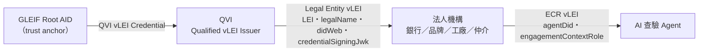

# vLEI 信任層規格

機構信任不再來自手動維護的公鑰名單（舊 `knownInstitutions`），而是來自 GLEIF vLEI
生態系的憑證鏈。勞工面的四張 SD-JWT 憑證與選擇性揭露機制**完全不變**（原則二）；
vLEI 只回答兩個問題：**這家機構是誰**（Legal Entity vLEI）、**這個 Agent 憑什麼**
（Engagement Context Role vLEI）。

## 信任鏈

- 每個節點是一個 KERI AID（自我定址識別碼），金鑰輪替寫入 KEL 並帶 pre-rotation 承諾。
- 每張憑證是 ACDC（v/d/i/ri/s/a/e/r），SAID 自我定址，撤銷狀態在簽發方的 TEL。
- 驗鏈時每一跳都重驗：SAID、簽章（經 KEL 解出簽發時金鑰）、TEL 狀態、schema SAID、
  LEI 檢查碼（ISO 17442 mod 97-10）與上下游 LEI 一致性。**上游撤銷即全鏈失效**：
  QVI 憑證被撤，所有 LE 與 ECR 立刻驗不過。

## 與 SD-JWT 世界的橋接

- LE vLEI 的 `credentialSigningJwk` 是機構簽 SD-JWT（勞工憑證與 DelegationCredential）
  的 ES256 公鑰。驗證方**只能**從已驗證的 LE 鏈取得這把鑰匙——沒有其他信任來源。
- L0 要求 Agent 同時出示 DelegationCredential（SD-JWT）與 ECR 鏈（ACDC），並比對
  `claims.agentDid === ecr.agentDid`、`claims.principal === le.didWeb`，不一致回
  `AGENT_VLEI_BINDING_MISMATCH`。
- L1 的 issuer 公鑰由 `resolveIssuerSigningKey`（agents/vleiBridge）從 LE 鏈解出，
  鏈壞回 `ISSUER_VLEI_CHAIN_INVALID`、被撤回 `ISSUER_VLEI_REVOKED`。

## Schema profiles

credentialType 沿用官方名稱（QualifiedvLEIIssuervLEICredential、
LegalEntityvLEICredential、LegalEntityOfficialOrganizationalRolevLEICredential、
LegalEntityEngagementContextRolevLEICredential）。擴充欄位：

| Schema | 官方欄位 | PoC 擴充欄位 | 擴充理由 |
|---|---|---|---|
| QVI | LEI | — | — |
| Legal Entity | LEI, legalName | didWeb, credentialSigningJwk, issuerTier | 綁定機構的 SD-JWT 簽章身分；`issuerTier` 由 QVI 寫入，機構改不了（題06 Q1） |
| OOR | LEI, personLegalName, officialRole | — | **已接線**：銀行覆核主管持有，稽核軌跡記其 SAID（題06 Q4） |
| ECR | LEI, engagementContextRole | agentDid | 兩種角色：`ai-verification-agent`（查驗 Agent）與 `third-party-auditor`（稽核機構背書） |

rules 區塊逐字收錄官方 usageDisclaimer 與 issuanceDisclaimer。

## 明文簡化與已補實項（PoC）

1. ~~單簽 KEL~~ → **已支援 kt 門檻多簽**（GLEIF root 為 2-of-3）；witness 與 delegated AID 仍未實作。
2. ~~KEL/TEL 以 in-process store 共享~~ → **可攜出示包**：出示以單一 JSON（credentials + KELs + TELs）傳遞，
   驗證方僅需帶外釘選 root AID，匯入時全部重驗；CESR stream framing 仍未實作。
3. Schema SAID 為本 repo 自算，非 GLEIF 登錄之官方 SAID（接軌路徑見 defense Q2）。
4. ~~偷到舊金鑰可偽簽舊 seq~~ → **TEL 事件已錨定控制者 KEL**：每個 vcp/iss/rev 先以現行金鑰
   在 KEL 寫入 seal（ixn）再簽發；偽簽者無法用舊金鑰延長 KEL 補錨，未錨定事件 fail-closed。
5. 所有 LEI 由 `syntheticLei()` 產生（tag + X 填充 + 合法檢查碼），明顯為合成值。
6. **角色憑證的持有者被擴充到自然人以外**，這是本 PoC 與 GLEIF 規範最明顯的一處偏離，
   必須主動說明而不是等人問：官方 OOR 與 ECR 都是**發給自然人**的。本 repo 有兩處擴充——
   ECR 發給 **AI Agent 的 DID**（`agentDid` 擴充欄位，是整個專案的前提：Agent 要有可撤銷的
   授權身分），以及 ECR 發給**稽核機構這個法人**以表示「第三方稽核者」資格。
   後者在正式 vLEI 裡更貼近的做法，是由該稽核機構的**自然人**持 OOR／ECR 代表機構背書，
   或以法人對法人的 ACDC 鏈結（edge）表示背書關係，而不是把角色憑證發給組織 DID。
   **對驗證邏輯沒有影響**（鏈驗證、撤銷級聯、角色比對都相同），但對「我們是否照規範建模」
   這個問題，誠實的答案是：**Agent 那一處是刻意且必要的擴充，稽核機構那一處是簡化。**

## 原因碼

L0：AGENT_VLEI_MISSING／AGENT_VLEI_CHAIN_INVALID／AGENT_VLEI_REVOKED／
AGENT_VLEI_BINDING_MISMATCH。L1：ISSUER_VLEI_CHAIN_INVALID／ISSUER_VLEI_REVOKED。
細粒度失因（SAID_MISMATCH 等 `VleiFailure`）只存在 `@eas/vlei` 內部，出閘門一律
折疊成上述原因碼，不夾帶任何欄位值。
